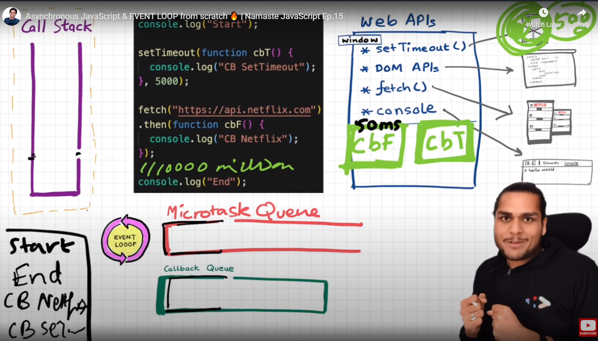

Javascript is a synchronous single threaded  means only go to next line if current line executed.
JS is a loosely typed language/ weakly typed lamguage, it does not attach its variable to any of its datatypes.

**Execution context** - Everything in JS happens inside the execution context.

- **Memory component** also known as *variable environment* - memory creation phase - where JS allocate to all variables, func...
- **Code Component** also known as *thread of execution* - code execution phase


When the JS code runs, Global Execution Context is created. In first phase it allocates memory to all variables and function and return "undefined" value to variable var and returns entire function for func like below:

```js

var n=2;
function square(num) {


    var ans = num*num;
    return ans;
}

var square2 = square(n);
var square4 = square(4);
```

**Phase 1:**

n: undefined
 square: (num){


    var ans = num*num;
    return ans;
}

square2: undefined
square4: undefined

**Phase 2:**

n: 2

when function is invoked - new execution context is created.


Call stack - Botton  of stack we have Global execution context. Maintains order of execution of execution context.


**Hoisting**

Access variables and function even before initializing it without error.


Shortest JS Program: Empty file - JS Engine will create Global Execution context - sets up. JS also creates window.
Window is a big object into global space. So JS Engine has given us.
In global level, this points to window object.
Window is a global obj along with GEC along with GEC, this is also created. JS is running on browser, servers etc. In Browser, its known as windows, In Node, whats the Global object?
this === window -> true

anything which is not inside a function is a global space. x is not in global space.

var a=10;
function b() {
    var x=10
}

window.a or a  or this are same. Assumes that if in global space

console.log(window.a) or console.log(a) or console.log(this.a);

**Scope in JS**

Scope in JS is dependent on Lexical Environment.  Where we can access specific var or func.
when Execution context is created Lexical Env is created. Lexical Env is local memory along with Lexical env of its parent.
Lexical as a term means hierarcy. c() function lexically inside a() function. a() is inside global scope. Lexical parent of c() is a()

function a() {
    function c(){
    console.log(b);
    }
}

var b = 10;
a();

--> 10 will be printed. 


**Scope Chaining** Scope chaining of lexical env is called scope chain. c() -> a() -> null


**let and const**

let and const declaration is hoisted. These are in temporal dead zone (TDZ).

console.log(b)
let a = 10;
var b = 100;

In case of var its in global space. attached to global object.

let and const are stored in separate memory space. Under Block.

So **Temporal Dead Zone** is a time between the variable is hoisted and till its initialized with value.
When variables are in temporal dead zone, we cannot access it, gives reference error. They can be accessed only after initialization happens.

incase of let, if we define a variable same var cannot be used again like,

let a = 10;
var a = 100; -> cannot be used in same scope again.

incase of const, even strict, same var and its value cannot be changed.

let a = 10;
let a = 20; // Uncaught Syntax Error: Identifier 'a' has already been declared.

console.log(a) // Uncaught Reference Error. Cannot access 'a' before initialization, because at this point of time, 'a' is in the TDZ
let a = 10;

console.log(y); // Uncaught Reference Error. y not defined.
let a = 100;


let a;
const b = 1000;
a=10;
console.log(a) //this is fine

let a;
const b; // Syntax Error: Missing initializer in const declaration
b=1000;
a=10;
console.log(a)

let a;
const b=1000; //variable b is of type const
b=10000; //TypeError: Assignment to constant variable
a=10;
console.log(a)


Best way to avoid TDZ is to push all initialization and declaration to top. Shrinked the TDZ window to zero.

**Block**

{ } - Block is defined by curly braces. Also known as Compound statement.

let and const are block scoped, not var. so they are hoisted in Block

Shadowing JS:


Script is outside scope. b value inside block is shadowing b value outside scope.

let b = 100;
{
    var a = 10;
    let b = 20;
    const c = 30;
    console.log(a)
    console.log(b)
    console.log(c)
};
console.log(b); --> 10,20,30,100


Illegal Shadowing - if we are trying to shadow let variable inside block scope using var not possible.

let a = 10;
{
    var a = 10; //no fine
}


var a = 10;
{
    let a = 10; //fine
}

Block scope follows Lexical scope.

**Closure**

Function along/bundled with its lexical scope, reference to the variable. Function along with its outer environment, combination of func and bunled together lexical scope.
Even if its executed in some other scope, it still still remembers its outer lexical env where it was present.

```js 
function x(){
    var a=8;
    function y(){
        console.log(a)
    }
    y();
}
x();

function x(){
    var a=8;

    y();
}
x(function y(){
        console.log(a)
    });


function x(){
    var a=8;
    function y(){
        console.log(a)
    }
    return y;
}
x();

var z = x();
console.log(z)
z(); though x goes off from EC, still it remembers its lexical scope. lexical binding. 

function x(){
    var a=8;
    return function y(){
        console.log(a)
    }
}
x();

var z = x();
console.log(z)
z();


```
**Uses of Closures**
- Module Design Patter
- Currying
- Function like once
- Memoize
- Maintaining state in async world
- setTimeouts
- Iterators
- Data Hiding


function x(){
    for (var i = 1; i<=5; i++){
        function close(i){
            setTimeout(function(){
                console.log(i);
            },i * 1000); //creates a fresh copy of i here with var, generally let does that since its referring to same memory space.
        }
            close(i)
        }
        console.log("Try")
    }

```js

function outer(){
    var a = 10;
    function inner(){
        console.log(a) // this function along with lexical parent is closure
    }
    return inner;
}

outer()(); //calling inner func also so ()()

var close = outer();
close(); //same as above

```

Closure Disadvantage: Memory consumption, memory leakage if not handled properly, need to do garbage collection (frees up unutilized memory)

function a() {
    var x = 0, z=10; //z will not longer be in memory, x will be in closure
    return function b(){
        console.log(x)
    }
}
var y = a(); //x memory cannot be free
y(); //V8 in Chrome it smartly collects garbage.

**First Class Function**

**Function Statement or Function Declaration** //Hoisting is the difference here
function a(){
    console.log("a called")
}
a();
**Function Expression**
var v = function y(){
    console.log("y called")
}
v();

**Anonymous Function**

function () {                  //function statements require a function name

}

**Named Function Expression**

var a = function b(){
    
}

**First call Functions**

func passed inside other function as a value


**Call Back Function**

Due to callback we can do async stuff in JS.


```js
setTimeout(function(){
    console.log("Timer")
},5000) //first parameter is callback function, which executed after sometime

function x(){
   console.log("x")
   y();
}

x( function y(){
    console.log("y")
}) //call back function. Never block the call stack
```

https://www.khanacademy.org/computing/computer-programming/html-css-js/html-js-dom-events/a/dom-event-types

**Event Loop**


setTimeout is not part of JavaScript, fetch, localStorage, console.log is not part JS. all this are part of Browser.
Browser gives access to all API inside callstack JS Engine.


Since all API are defined in Global Scope, we don't need to use window/this keywork while using it. Browser wraps up all API and gives access to JS Engine.

**Call Back Queue/ Task Queue**

when setTimeout function expires, the cb function is put inside the callback queue. Job of event loop acts like gatekeeper and pushes the callback function from cb queue to callstack.

addEventListeners registers a callback method on click handler inside Web API Environment. Event is attached which is "click" event.

Event loop continously monitor callback queue and callstack

```js
console.log("start")

document.getElementById("btn")
.addEventListener("click",function cb(){
    console.log("Callback")
});

console.log("End")
```

**Micro Task Queue**

Has higher priority than Callback Queue.

Callback functions incase of promises comes to Micro Task Queue.


**Mutation Observer** - Mutation in DOM Tree and **Promises** goes inside Microtask Queue.

**Starvation of task inside Callback Queue, when Microtasks creates subtasks within itself**

**Javascript RunTime Env** - Big container to run any piece of JS code through JS Engine, it has Callback Queue, MQ etc.

Browser can only execute JS code since it has Javascript Runtime Environment. Node JS also has Javascript Runtime Env.

JS Engine is not a machine. JS Engine is just a code written in Lowlevel language. it splits the high level code and converts to machine readable format.

Code -> Parsing -> Compilation -> Execution.

During parsing phase, code is broken down to token. let a = 7 --> let,a and 7 are broken down to tokens.
Job of Syntax Parser is to take code and convert to **Abstract Syntax Tree**
So AST is generated after Parsing level.

**Just In Time - JIT Compilation** - Uses both interpreter and compiler.

Interpreter takes code and executes line by line. It's fast.
Compiler whole code is compiled before executed, its modified to optimized version of code.

**AST -> Interpreter -> converts highlevel code to byte code, and compiler helps in optimize the code during run time and code moves to execution step**

**Ahead of Time Compilation - AOT**
Compiler takes piece of code optimizes it and send to Execution Phase. 

**Memory Heap** - This is the place all memory is stored which is sync with callstack and garbage collector. 

Garbage collector free up memory space when func not used - uses Algorith called "Mark and Sweep Algorithm"

**Inlining, Copy Elision, Caching** - are optimization techniques.

**V8 Chrome JS Engine** has interpreter called "ignition", "Turbo Fan" Optimizing compiler - makes our code runs very fast.

**Orinoco and Oil Pan** - Garbage Collector used by V8


Why setTimeout set to 0? to defer the code.


**Higher Order Function** - Function that takes another function as input to itself and returns the function from itself. Function that is passed inside HOF is CallBack Function(which is called sometime in the program) - also called "First Class Citizen"


const arr = [5,1,3,2,4];

**Number to Binary array:**

const output = arr.map((x) => x.toString(2));
console.log(output)

**number > 4**

const output = arr.filter((x) => x > 4);
console.log(output)

**Sum**

function findSum(arr){
    let sum = 0;
    for (let i=0; i<arr.length; i++){
        sum = sum + arr[i];
    }
    return sum;
}
console.log(findSum(arr));

const output = arr.reduce(function (acc,curr){ //curr will be arr[i] values, acc will be accumulate of those array values of current parameter
    acc = acc + curr
    return acc;
},0)
console.log(output)

**Max**

function findMax(arr){
    let max = 0;
    for(let i=0; i < arr.length; i++){
        if(arr[i]>max) {
            max = arr[i]
        }
    }
    return max;
}

console.log(findMax(arr));

const output = arr.reduce(function (max,curr){
    if (curr > max){
        max = curr;
    }
    return max;
},0)


**Call Back Hell/ Pyramid of Doom**

--> Inversion of control - loose control of your code while using callbacks. We don't know what is happening in createOrder api. 
so we are giving control of our function to createOrder api function

```js

const cart = ["shoes","pants","kurta"];

api.createOrder(cart, function(){
    api.proceedToPayment(function(){
        api.showOrderSummary(function(){
            api.updateWallet()
        }
        )
    })
})
```

**Promises** - Used to handle Async operations in JS.

1 . CONSUMING PROMISES

```js

const cart = ["shoes","pants","kurta"];

createOrder(cart, function (OrderId) {  //responsibility of createOrder api is to create an order first and then call the callback function back once order is created with orderId.
    proceedToPayment(orderId);
})

.fetch()
.then()

const promise = createOrder(cart); //promise here is an empty obj {data: undefined} after returning promise value will be updated till then other lines of code will get executed.
//{data: orderDetails}


promise.then(function (OrderId) {  
    proceedToPayment(orderId);
}); //attaching promise object, we have control of our program and will be called only once.

```
**State of Promise** (Placeholders/container for certain period of time until we receive value from async operation)

**Promise is an object representing the eventual completion of asynchronous operation**

1. Pending
2. Fulfilled
3. Rejected

Ways to attach handlers using .then()

**Promise Objects are immutable**

**Promise Chaining**

```js

createOrder(cart)
.then(function (OrderId) {
    proceedToPayment(OrderId)
})
.then(function (paymentInfo) {
    showOrderSummary(paymentInfo)
})
.then(function (paymentInfo) {
    updateWallet(paymentInfo)
});

SAME AS

createOrder(cart)
.then((OrderId) => proceedToPayment(OrderId))
.then((paymentInfo) => showOrderSummary(paymentInfo))
.then((paymentInfo) => updateWallet(paymentInfo));

```

2. CREATING PROMISES/ PRODUCER

const cart = ["shoes","pants","kurta"];

```js

createOrder(cart): //orderId - async api

const promise = createOrder(cart);

promise.then(function(){
    //proceedToPayment(orderId);
    console.log(orderId)
})
.catch(function(err){
    console.log(err.message)
})

function createOrder(cart){
    const pr = new Promise(function(resolve,reject){ //this is a promise constructor taking func resolve and reject
        //create an order
        //validate cart
        //orderId to return success/failure
        if(!validateCart(cart)){
            const err = new Error("Cart is not valid)
            reject(err)
        }
        //logic for orderId
        const orderId = "12345";
        if(orderId) {
            resolve(orderId)
        }
    });
    return pr;
}

function validateCart(cart){
    return true;
}
```


//Implement promises for all 4 async api's discussed above.

**Async**

Async function always returns a promise.

If async function should be created, then create like below

```js

async function getData() {
    return "hey"; //either return a promise or automatically wraps a value inside promise and return a promise
}

const data = getData();
console.log(data)
```

**Async and await used to handle promises**

1. Use await keyword infront of the promise and it resolves promise
2. await can only be used inside async function
3. Normally promise does not complete quickly, making an api call it takes time that's why we wrap it inside a promise that's why its an async operation.
4. As soon as func (getData) gets executed it registers promise and takes callback function and keeps it separately till its resolved.
6. when await is seen, function executes suspends and wait till promise is resolved and only then it move ahead. 
7. promise function starts executing where it left
8. JS engine is not waiting but handlePromise will suspend the execution and continue once promise is resolved
9. Async/await are syntactic sugar over fetch/then. Behind the scene, JS will treat it as promise methods

**Promise.all** - *Fail Fast*

1. if all success, it will wait for all other promises to succeed and then give result after 3secs.

promise.all - takes iterables/arrays of promises as input

promises.all([p1,p2,p3]) //make 3 parallel calls and gives the result

p1 = 3 secs
p2 = 1 sec
p3 = 2 secs

if all pass, collect all results keeps in array and give it back -> [val1,val2,val3]

-> It will wait for all of them to complete

2. if one of the promises fail, let's say p2 fails after 1 sec. So as soon as any of the promise gets rejected, promise.all will throw an error. will not wait for other promises to get completed
3. for p1 and p3 already api calls are made, promises are created so it cannot be cancelled. the whole collection of promises will be failed after 1sec. 

**Promise.allSettled** - *Waits for all promises to complete, safest of all - only returns promise only after all settles*

1. if all successfull, after 3 secs we will get same result as promise.all -> [val1,err2,val3]
2. if one of it gets rejected, lets say p2, it will still wait for other promises to settle(whether success/failure). It will take 3secs to complete. The output will be same number of array.
3. result will be an object


**Promise.race** - *return the result of first settled promise*

1. Promise which completes first, after 1sec will give result of val2 (value of second promise, first settled promise)
2. Same for failure, returns based on seconds it completes -> [p2] or [err2]

**promise.any** - *wait for first resolved/success promise,  when it finds success it returns promise, success seeking*

1. if all promises fails, returned result will be aggregated error - list of or array of all 3 errors. [err1,err2,err3] after 3secs.

**Before browser catches error, we need to catch, dont leave your error uncaught -> .catch((err) => {console.error(err)})**

