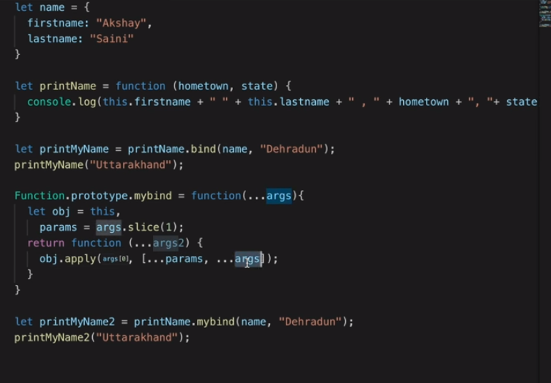

1. **Object `name1`**:
   - `name1` is an object with two properties: `firstname` and `lastname`.
   - It represents a person's name.

2. **Function `printFullname`**:
   - `printFullname` is a function that takes three parameters: `hometown`, `state`, and `country`.
   - Inside the function, it logs a concatenated string containing the person's full name (from `name1`) along with the provided location details.

3. **`bind` Method**:
   - The `bind` method creates a new function (in this case, `printMyname`) that is bound to a specific context (`name1`).
   - The first argument to `bind` specifies the context (`this` value) for the new function.
   - Additional arguments passed to `bind` are partially applied to the original function (`printFullname`).
   - In this example:
     - `printMyname` is a new function that always has `name1` as its context.
     - The `hometown` and `state` arguments are pre-filled with values ("Chennai" and "India", respectively).
     - When you call `printMyname("Tamil Nadu")`, it completes the function by adding the "Tamil Nadu" argument.

4. **Custom `mybind` Method**:
   - The user has defined a custom `mybind` method on the `Function.prototype`.
   - This method allows you to create a similar bound function as `bind`.
   - It takes any number of arguments (including the context and partially applied arguments).
   - Inside the `mybind` implementation:
     - `obj` refers to the original function (in this case, `printFullname`).
     - `params` holds the partially applied arguments (e.g., "Chennai" and "India").
     - The returned function (created by `mybind`) combines the `params` with any additional arguments passed when invoking the bound function.

5. **Using `mybind`**:
   - The line `let printMyname2 = printFullname.mybind(name1, "Chennai","India");` creates a new function (`printMyname2`) that is bound to `name1` and has the location details pre-filled.
   - When you call `printMyname2("Tamil Nadu")`, it completes the function by adding the "Tamil Nadu" argument.

In summary, both `bind` and the custom `mybind` achieve the same goal: creating a new function with a fixed context and partially applied arguments. They allow you to create reusable functions with specific configurations.

**How closures involved**


1. **Definition of Closures**:
   - A **closure** is a function that "remembers" its lexical scope (the environment in which it was created) even when it is executed outside that scope.
   - Closures allow functions to access variables from their outer (enclosing) function, even after the outer function has finished executing.

2. **Closures in the Code**:
   - In the given code snippet, we have two functions: `printFullname` and `mybind`.
   - Both of these functions create closures.

3. **Closures in `printFullname`**:
   - `printFullname` is defined within the outer function (the anonymous function assigned to `debounce` or `mybind`).
   - Inside `printFullname`, we reference the `this` context (which includes `firstname` and `lastname`) and the `hometown`, `state`, and `country` parameters.
   - When `printFullname` is returned from the outer function, it "captures" its surrounding scope (including the context and parameters) as a closure.
   - Later, when `printMyname` or `printMyname2` (created using `bind` or `mybind`) is invoked, it still has access to the captured context and partially applied arguments due to the closure.

4. **Closures in `mybind`**:
   - The custom `mybind` method is also defined within an outer function (the anonymous function assigned to `Function.prototype`).
   - Inside `mybind`, we reference the original function (`obj`, which is `printFullname` in this case) and the partially applied arguments (`params`).
   - The returned function (created by `mybind`) captures the surrounding scope (including `obj` and `params`) as a closure.
   - When `printMyname2` (created using `mybind`) is invoked, it still has access to the captured context and partially applied arguments due to the closure.

5. **Role of Closures**:
   - Closures allow us to create specialized functions (like `printMyname` and `printMyname2`) that retain specific configurations (context and partially applied arguments).
   - Without closures, these functions would lose access to the necessary data once the outer functions finished executing.

In summary, closures enable the persistence of context and partially applied arguments, making the debounced and bound functions work correctly even after their outer functions have completed execution. 

**Lexical Scope**

Certainly! Let's dive into the concept of **lexical scope** in JavaScript:

1. **What Is Lexical Scope?**:
   - Lexical scope (also known as static scope) refers to how variable names are resolved during the compilation phase of code execution.
   - It is determined by the physical placement of variables and functions in the source code, rather than their runtime behavior.
   - Lexical scope remains fixed throughout the execution of the program.

2. **How Lexical Scope Works**:
   - When a function is defined, it "captures" its surrounding scope (the environment in which it was created).
   - The function retains access to variables and functions from its outer (enclosing) scope, even if it is executed elsewhere.
   - The scope chain is established based on the nesting of functions within each other.

3. **Example of Lexical Scope**:
   ```javascript
   const globalVar = "I am global"; // Global scope

   function outer() {
     const outerVar = "I am outer"; // Outer scope

     function inner() {
       const innerVar = "I am inner"; // Inner scope
       console.log(globalVar, outerVar, innerVar);
     }

     inner();
   }

   outer();
   ```
   - In this example:
     - `inner` function has access to variables from its outer scopes (`globalVar` and `outerVar`).
     - The scope chain for `inner` is: `inner` scope -> `outer` scope -> global scope.

4. **Benefits of Lexical Scope**:
   - Predictable Behavior: Lexical scope ensures that variable references are resolved consistently based on their location in the code.
   - Encapsulation: Functions can encapsulate their own state without interfering with other parts of the program.

5. **Lexical vs. Dynamic Scope**:
   - Lexical scope is contrasted with dynamic scope, where variable resolution depends on the call stack at runtime (not the code structure).
   - JavaScript uses lexical scope.

In summary, lexical scope allows functions to "remember" their surrounding context, leading to predictable variable resolution. It's a fundamental concept in JavaScript that influences how we organize and access variables within our code. 

References:
- [Lexical Scope in JavaScript – What Exactly Is Scope in JS?](https://www.freecodecamp.org/news/javascript-lexical-scope-tutorial/)
- [Lexical Scope in JavaScript - GeeksforGeeks](https://www.geeksforgeeks.org/lexical-scope-in-javascript/)
- [Understanding Lexical Scope in JavaScript: A Comprehensive Guide](https://www.ghazikhan.in/blog/understanding-lexical-scope-javascript-guide)
- [JavaScript Scope and Closure — A Look at Lexical Scope](https://betterprogramming.pub/scope-closure-lexical-scope-9a18d0579d66)

Source: Conversation with Bing, 5/9/2024
(1) Lexical Scope in JavaScript – What Exactly Is Scope in JS?. https://www.freecodecamp.org/news/javascript-lexical-scope-tutorial/.
(2) Lexical Scope in JavaScript - GeeksforGeeks. https://www.geeksforgeeks.org/lexical-scope-in-javascript/.
(3) JavaScript Scope and Closure — A Look at Lexical Scope. https://betterprogramming.pub/scope-closure-lexical-scope-9a18d0579d66.
(4) Understanding Lexical Scope in JavaScript: A Comprehensive Guide. https://www.ghazikhan.in/blog/understanding-lexical-scope-javascript-guide.

**How does lexical scope impact variable hoisting in JavaScript?**

**Lexical scope** in JavaScript plays a significant role in the behavior of **variable hoisting**. Let's explore how these concepts are related:

1. **Variable Hoisting**:
   - Variable hoisting is a JavaScript behavior where variable and function declarations are moved to the top of their respective scopes during the compilation phase.
   - During hoisting, variable declarations (using `var`, `let`, or `const`) are processed before the actual code execution begins.
   - However, it's essential to understand that only declarations (not initializations) are hoisted.

2. **Lexical Scope and Hoisting**:
   - Lexical scope determines the accessibility of variables based on where they are defined in the source code.
   - When a variable is declared using `var` or `let`, its scope is determined by its surrounding block (function or global scope).
   - Here's how lexical scope impacts variable hoisting:

3. **Hoisting Behavior with `var`**:
   - Variables declared with `var` are hoisted to the top of their enclosing function or global scope.
   - However, only the declaration (not the initialization) is hoisted.
   - Example:

     ```javascript
     console.log(x); // Output: undefined
     var x = 5;
     ```

     - In this example:
       - The variable `x` is hoisted to the top of the function scope.
       - The declaration `var x;` is processed first (resulting in `undefined`).
       - The initialization `x = 5;` occurs later in the code.

4. **Hoisting Behavior with `let` and `const`**:
   - Variables declared with `let` and `const` are also hoisted but behave differently:
     - They are hoisted to the top of their block scope (not the entire function or global scope).
     - Unlike `var`, they are not initialized during hoisting (they remain in the "temporal dead zone").
     - Example:

     ```javascript
     console.log(y); // Throws ReferenceError: Cannot access 'y' before initialization
     let y = 7;
     ```

     - In this example:
       - The variable `y` is hoisted to the top of the block scope (within the `let` statement).
       - However, accessing it before initialization results in a `ReferenceError`.

5. **Best Practice**:
   - To avoid unexpected behavior, always declare your variables at the beginning of their scope (function or block).
   - Understand lexical scope and how it affects variable visibility throughout your code.

In summary, lexical scope influences how variables are hoisted and accessed within your JavaScript code. Understanding these concepts helps you write more predictable and maintainable code! 
[geeksforgeeks](#hint(Copilot_language="English"))
[2](#hint(Copilot_language="English"))
[11](#hint(Copilot_language="English"))
[12](#hint(Copilot_language="English"))
[13](#hint(Copilot_language="English"))
[5](#hint(Copilot_language="English"))
[6](#hint(Copilot_language="English"))
[7](#hint(Copilot_language="English"))
[8](#hint(Copilot_language="English"))
[9](#hint(Copilot_language="English"))
[10](#hint(Copilot_language="English"))

Source: Conversation with Bing, 5/9/2024
(1) Lexical Scope in JavaScript – Beginner's Guide - freeCodeCamp.org. https://www.freecodecamp.org/news/lexical-scope-in-javascript/.
(2) Demystifying JavaScript Variable Scope and Hoisting - SitePoint. https://www.sitepoint.com/demystifying-javascript-variable-scope-hoisting/.
(3) Javascript’s lexical scope, hoisting and closures without mystery.. https://medium.com/@nickbalestra/javascripts-lexical-scope-hoisting-and-closures-without-mystery-c2324681d4be.
(4) Understanding hoisting,scopes, and closures in JavaScript. https://dev.to/samaghapour/understanding-hoistingscopes-and-closures-in-javascript-3337.
(5) Lexical Scope in JavaScript - GeeksforGeeks. https://www.geeksforgeeks.org/lexical-scope-in-javascript/.
(6) Understanding Lexical Scope in JavaScript: A Comprehensive Guide. https://www.ghazikhan.in/blog/understanding-lexical-scope-javascript-guide.
(7) What is Lexical Scope in JavaScript? - Medium. https://medium.com/@catherineisonline/what-is-lexical-scope-in-javascript-708b1d1487ea.
(8) Lexical Scope in JavaScript – What Exactly Is Scope in JS?. https://www.freecodecamp.org/news/javascript-lexical-scope-tutorial/.
(9) JavaScript Hoisting - W3Schools. https://www.w3schools.com/js/js_hoisting.asp.
(10) JavaScript Hoisting - GeeksforGeeks. https://www.geeksforgeeks.org/javascript-hoisting/.
(11) Hoisting in JavaScript - Stack Abuse. https://stackabuse.com/hoisting-in-javascript/.
(12) Understanding Hoisting in JavaScript | DigitalOcean. https://www.digitalocean.com/community/tutorials/understanding-hoisting-in-javascript.
(13) JavaScript Hoisting (with Examples) - Programiz. https://www.programiz.com/javascript/hoisting.

Certainly! The introduction of `let` and `const` as alternatives to `var` in JavaScript was driven by the need to address some limitations and issues associated with the `var` keyword. Let's explore the differences and motivations behind each of these variable declaration options:

1. **`var`**:
   - Before ES6 (ES2015), `var` was the primary way to declare variables in JavaScript.
   - **Issues with `var`**:
     - **Function Scope**: Variables declared with `var` are function-scoped. This means they are accessible throughout the entire function where they are defined, even if declared within nested blocks.
     - **Hoisting**: `var` variables are hoisted to the top of their enclosing function or global scope during compilation. However, only the declaration (not the initialization) is hoisted, leading to potential unexpected behavior.
     - **Re-declaration and Re-assignment**: `var` allows re-declaration and re-assignment within the same scope, which can lead to accidental overwriting of variables.

2. **`let`**:
   - Introduced in ES6, `let` provides an alternative to `var` with improved scoping rules.
   - **Block Scope**: Variables declared with `let` are block-scoped. They are accessible only within the block (enclosed by curly braces) where they are defined.
   - **No Hoisting Issues**: Like `var`, `let` variables are hoisted, but they remain uninitialized (in the "temporal dead zone") until their actual declaration.
   - **No Re-declaration**: Unlike `var`, `let` does not allow re-declaration of the same variable within the same scope.

3. **`const`**:
   - Also introduced in ES6, `const` is used for declaring constants.
   - **Block Scope**: Like `let`, `const` variables are block-scoped.
   - **Immutable Value**: Once assigned, the value of a `const` variable cannot be changed. It remains constant throughout its lifetime.
   - **No Re-assignment**: `const` variables cannot be re-assigned to a different value after initialization.

4. **When to Use Each**:
   - Use `let` when you need to reassign the variable's value within the same block.
   - Use `const` when the value should never change after initialization (for constants).
   - Avoid using `var` due to its unpredictable behavior and scope issues.

In summary, `let` and `const` were introduced to provide more predictable scoping rules, prevent accidental re-assignment, and improve overall code quality compared to the older `var` keyword.

References:
- [Var, Let, and Const – What's the Difference?](https://www.freecodecamp.org/news/var-let-and-const-whats-the-difference/)
- [Understanding var, let and const keywords and using them in the right way](https://sebhastian.com/javascript-let-var-const/)
- [JavaScript Variable: Should you choose let, var or const?](https://dev.to/shameel/javascript-variable-should-you-choose-let-var-or-const-47ke)
- [What is the difference between "let" and "var"?](https://stackoverflow.com/questions/762011/what-is-the-difference-between-let-and-var)
- [VAR vs LET vs CONST - Understanding the Difference](https://stackforest.hashnode.dev/var-vs-let-vs-const-in-javascript) ¹²³⁴⁵

Source: Conversation with Bing, 5/9/2024
(1) Var, Let, and Const – What's the Difference? - freeCodeCamp.org. https://www.freecodecamp.org/news/var-let-and-const-whats-the-difference/.
(2) Understanding var, let and const keywords and using them in the right .... https://sebhastian.com/javascript-let-var-const/.
(3) JavaScript Variable: Should you choose let, var or const?. https://dev.to/shameel/javascript-variable-should-you-choose-let-var-or-const-47ke.
(4) What is the difference between "let" and "var"? - Stack Overflow. https://stackoverflow.com/questions/762011/what-is-the-difference-between-let-and-var.
(5) VAR vs LET vs CONST - Understanding the Difference. https://stackforest.hashnode.dev/var-vs-let-vs-const-in-javascript.

Certainly! **Immutability** is a fundamental concept in programming languages, and it refers to the property of an object or value that cannot be changed after it is created. Let's explore immutability in more detail:

1. **What Is Immutability?**
   - In the context of programming, immutability means that once a variable or object is assigned a value, that value cannot be modified throughout its lifetime.
   - An immutable object remains constant and unchangeable after its creation.

2. **Examples of Immutability**:
   - **Strings**: In many programming languages, strings are immutable. Once you create a string, you cannot modify its characters individually. Instead, you create new strings by concatenating or manipulating existing ones.
   - **Numbers**: Numeric values (integers, floats) are also immutable. For example, if you have the number `5`, you cannot change it to `6`. You create new numbers based on existing ones (e.g., addition, subtraction).
   - **Immutable Collections**: Some languages provide immutable collections (e.g., lists, sets, maps). These collections cannot be modified after creation. Instead, you create new collections with added or removed elements.

3. **Benefits of Immutability**:
   - **Predictable Behavior**: Immutable objects always have the same value, which simplifies reasoning about code.
   - **Thread Safety**: Immutable data structures are inherently thread-safe because they cannot be modified concurrently.
   - **Functional Programming**: Immutability aligns well with functional programming principles, where functions avoid side effects and operate on immutable data.

4. **How Immutability Is Achieved**:
   - **Creating New Instances**: Instead of modifying existing objects, you create new instances with updated values.
   - **Copying with Modifications**: For complex data structures (e.g., arrays, maps), you copy the existing structure and modify the copy.
   - **`const` and `readonly`**: Some languages provide keywords (`const` in JavaScript, `readonly` in C#) to declare variables as immutable.

5. **Common Misconceptions**:
   - **Not About Visibility**: Immutability is not about making objects read-only or giving them low visibility. It's about preventing changes to their state.
   - **Not Only for User Input**: Immutability applies to all objects, not just those related to user input. It's about maintaining consistency and predictability.

6. **Use Cases for Immutability**:
   - **Functional Programming**: Immutability is central to functional programming paradigms.
   - **Caching and Memoization**: Immutable data can be efficiently cached and reused.
   - **State Management**: Immutable state in applications (e.g., Redux in React) simplifies state updates.

In summary, immutability ensures that once a value is set, it remains unchanged. By embracing immutability, you create more reliable, maintainable, and thread-safe code. 

References:
- [Stack Overflow: What is Immutability?](https://stackoverflow.com/questions/622664/what-is-immutability-and-why-should-i-worry-about-it)
- [Immutability in Functional Programming](https://adabeat.com/fp/immutability-in-functional-programming/)
- [Immutable Object (Wikipedia)](https://en.wikipedia.org/wiki/Immutable_object)
- [Immutability in Functional Programming (Learning Journal)](https://www.learningjournal.guru/article/scala/functional-programming/immutability-in-functional-programming/)
- [Immutable vs Mutable: Definitions, Benefits & Practical Tips](https://www.tiny.cloud/blog/mutable-vs-immutable-javascript/) ¹²³⁴⁵

Source: Conversation with Bing, 5/9/2024
(1) What is immutability and why should I worry about it?. https://stackoverflow.com/questions/622664/what-is-immutability-and-why-should-i-worry-about-it.
(2) Immutability in Functional Programming - Ada Beat. https://adabeat.com/fp/immutability-in-functional-programming/.
(3) Immutable object - Wikipedia. https://en.wikipedia.org/wiki/Immutable_object.
(4) Immutability in Functional Programming- Learning Journal. https://www.learningjournal.guru/article/scala/functional-programming/immutability-in-functional-programming/.
(5) Immutable vs mutable: Definitions, benefits & practical tips - TinyMCE. https://www.tiny.cloud/blog/mutable-vs-immutable-javascript/.

Certainly! Enforcing immutability in your JavaScript code is essential for maintaining predictable behavior, avoiding side effects, and improving code quality. Let's explore some techniques to achieve immutability:

1. **Using `const`**:
   - The `const` keyword declares a variable that cannot be reassigned after its initial value is set.
   - While `const` doesn't make objects themselves immutable (you can still modify their properties), it prevents reassignment of the entire object.
   - Example:

     ```javascript
     const person = { name: 'Alice' };
     // This is allowed:
     person.name = 'Bob';
     // This is not allowed:
     person = { name: 'Charlie' }; // Error: Assignment to constant variable
     ```

2. **Object.freeze()**:
   - The `Object.freeze()` method makes an object completely immutable.
   - It prevents adding, deleting, or modifying properties of the object.
   - Example:

     ```javascript
     const frozenPerson = Object.freeze({ name: 'Alice' });
     // These operations are not allowed:
     frozenPerson.name = 'Bob'; // No effect
     delete frozenPerson.name; // No effect
     ```

3. **Immutable Libraries**:
   - Consider using libraries like Immutable.js, Immer, or Mori.
   - These libraries provide data structures (such as lists, maps, and sets) that are inherently immutable.
   - Example with Immutable.js:

     ```javascript
     const { Map } = require('immutable');
     const immutableMap = Map({ key: 'value' });
     // Operations return new immutable maps:
     const updatedMap = immutableMap.set('key', 'new value');
     ```

4. **Functional Programming Techniques**:
   - Use functional programming practices to create new data structures instead of modifying existing ones.
   - Techniques like map, filter, and reduce allow you to work with immutable data.

5. **Linting Tools**:
   - Use linting tools like ESLint with plugins (e.g., eslint-plugin-immutable) to enforce immutability rules in your code.
   - These tools catch potential issues during development.

Remember that enforcing immutability leads to more reliable and maintainable code. Choose the approach that best fits your project and coding style! 🚀🔒

References:
- [Immutability in JavaScript – Explained with Examples](https://www.freecodecamp.org/news/immutability-in-javascript-with-examples/)
- [Immutability in JavaScript: Why It’s Important and How to Achieve It](https://codedamn.com/news/javascript/immutability-in-javascript)
- [The Importance of Immutability and Pure Functions in JavaScript](https://codedamn.com/news/javascript/immutability-pure-functions)
- [Create immutable object in JavaScript](https://stackoverflow.com/questions/46853278/create-immutable-object-in-javascript) ¹²³⁴⁵

Source: Conversation with Bing, 5/9/2024
(1) Immutability in JavaScript – Explained with Examples - freeCodeCamp.org. https://www.freecodecamp.org/news/immutability-in-javascript-with-examples/.
(2) Immutability in JavaScript: Why It’s Important and How to ... - codedamn. https://codedamn.com/news/javascript/immutability-in-javascript.
(3) The Importance of Immutability and Pure Functions in JavaScript: A .... https://codedamn.com/news/javascript/immutability-pure-functions.
(4) immutability - Create immutable object in javascript - Stack Overflow. https://stackoverflow.com/questions/46853278/create-immutable-object-in-javascript.
(5) Why is immutability so important (or needed) in JavaScript?. https://stackoverflow.com/questions/34385243/why-is-immutability-so-important-or-needed-in-javascript.

Certainly! When working with `const` in JavaScript, there are some common pitfalls to be aware of. Let's explore them:

1. **Reassignment of `const` Variables**:
   - The most obvious pitfall is assuming that `const` variables cannot be changed at all. While `const` prevents reassignment of the entire variable, it does not make the value itself immutable.
   - Example:

     ```javascript
     const pi = 3.14;
     pi = 3.14159; // Error: Assignment to constant variable
     ```

   - Solution: Use `const` for values that should not be reassigned. If you need a mutable value, consider using `let`.

2. **Object Properties and `const`**:
   - When an object is declared with `const`, the object itself cannot be reassigned, but its properties can still be modified.
   - Example:

     ```javascript
     const person = { name: 'Alice' };
     person.name = 'Bob'; // Allowed
     ```

   - Solution: If you want an entirely immutable object, consider using `Object.freeze()` or creating a new object with updated properties.

3. **Block Scoping with `const`**:
   - Unlike `var`, `const` and `let` are block-scoped. However, be cautious when using `const` within loops or conditional statements.
   - Example:

     ```javascript
     if (true) {
       const x = 10;
     }
     console.log(x); // Error: x is not defined
     ```

   - Solution: Declare `const` variables in the appropriate scope (e.g., outside the loop or function).

4. **`const` and Arrays**:
   - When an array is declared with `const`, the array itself cannot be reassigned, but its elements can still be modified.
   - Example:

     ```javascript
     const numbers = [1, 2, 3];
     numbers.push(4); // Allowed
     ```

   - Solution: If you want an entirely immutable array, consider using `Object.freeze()` or creating a new array with updated elements.

5. **`const` and Arrow Functions**:
   - Arrow functions assigned to `const` variables retain their lexical `this` binding.
   - Example:

     ```javascript
     const greet = () => {
       console.log(this); // Refers to the global object (window in browsers)
     };
     greet();
     ```

   - Solution: Be aware of how arrow functions behave with `this`. If dynamic `this` binding is needed, use regular function expressions.

6. **Avoid Using `const` for Loop Counters**:
   - Using `const` for loop counters can lead to unexpected behavior.
   - Example:

     ```javascript
     for (const i = 0; i < 5; i++) {
       console.log(i); // Error: Assignment to constant variable
     }
     ```

   - Solution: Use `let` for loop counters.

Remember these pitfalls to write more reliable and maintainable code when using `const` in JavaScript! 🚀🔒
[1](https://medium.com/@drmelchisedecbankole/20-best-practices-and-considerations-for-javascript-execution-context-bf8c56613682) [2](https://basatmaqsood.medium.com/navigating-common-javascript-pitfalls-a-developers-guide-3aa669329305) [3](https://www.freecodecamp.org/news/nine-most-common-mistakes-developers-make-in-javascript/) [4](https://dev.to/imranabdulmalik/mastering-closures-in-javascript-a-comprehensive-guide-4ja8) [5](https://www.tiny.cloud/blog/mutable-vs-immutable-javascript/) [6](https://codedamn.com/news/javascript/immutability-in-javascript-with-examples/) [7](https://codedamn.com/news/javascript/immutability-pure-functions) [8](https://codedamn.com/news/javascript/immutability-in-functional-programming) [9](https://stackoverflow.com/questions/622664/what-is-immutability-and-why-should-i-worry-about-it) [10](https://stackoverflow.com/questions/46853278/create-immutable-object-in-javascript) [11](https://blog.devgenius.io/10-javascript-bad-practices-you-should-avoid-e889f64841bc) [12](https://www.freecodecamp.org/news/nine-most-common-mistakes-developers-make-in-javascript/) [13](https://www.freecodecamp.org/news/javascript-lexical-scope-tutorial/) ¹²³⁴⁵

Source: Conversation with Bing, 5/9/2024
(1) 20 Best Practices and Considerations for JavaScript Execution ... - Medium. https://medium.com/@drmelchisedecbankole/20-best-practices-and-considerations-for-javascript-execution-context-bf8c56613682.
(2) Navigating Common JavaScript Pitfalls: A Developer’s Guide. https://basatmaqsood.medium.com/navigating-common-javascript-pitfalls-a-developers-guide-3aa669329305.
(3) 10 JavaScript Bad Practices You Should Avoid - Dev Genius. https://blog.devgenius.io/10-javascript-bad-practices-you-should-avoid-e889f64841bc.
(4) Mastering Closures in JavaScript: A Comprehensive Guide. https://dev.to/imranabdulmalik/mastering-closures-in-javascript-a-comprehensive-guide-4ja8.
(5) The Nine Most Common Mistakes Developers Make in JavaScript (and How to .... https://www.freecodecamp.org/news/nine-most-common-mistakes-developers-make-in-javascript/.

Certainly! Destructuring assignment in JavaScript allows you to extract values from arrays or properties from objects and assign them to distinct variables. When combined with `const`, you can create read-only variables that hold specific values from an array or object. Let's explore how to use destructuring with `const`:

1. **Destructuring Arrays with `const`**:
   - When destructuring an array, you can use `const` to declare variables that hold specific elements from the array.
   - Example:

     ```javascript
     const numbers = [1, 2, 3, 4, 5];
     const [firstNumber, secondNumber] = numbers;

     console.log(firstNumber); // 1
     console.log(secondNumber); // 2
     ```

   - In this example, `firstNumber` and `secondNumber` are constants holding the values extracted from the `numbers` array.

2. **Destructuring Objects with `const`**:
   - When destructuring an object, you can use `const` to declare variables that hold specific properties from the object.
   - Example:

     ```javascript
     const person = { name: 'Alice', age: 30 };
     const { name, age } = person;

     console.log(name); // 'Alice'
     console.log(age); // 30
     ```

   - Here, `name` and `age` are constants containing the values of the corresponding properties from the `person` object.

3. **Nested Destructuring with `const`**:
   - You can also destructure nested properties from objects.
   - Example:

     ```javascript
     const complexObject = { a: 1, b: { c: 2 } };
     const { a, b: { c } } = complexObject;

     console.log(a); // 1
     console.log(c); // 2
     ```

   - In this case, `a` holds the value of the top-level property, and `c` holds the value of the nested property.

4. **Benefits of Using `const` with Destructuring**:
   - Readability: Destructuring with `const` makes your code concise and easy to understand.
   - Immutability: Since `const` variables cannot be reassigned, the extracted values remain constant.

Remember that using `const` with destructuring allows you to create read-only variables that hold specific values from arrays or objects. It's a powerful technique for working with structured data! 🚀🔍

References:
- [Destructuring assignment - JavaScript | MDN](https://developer.mozilla.org/en-US/docs/Web/JavaScript/Reference/Operators/Destructuring_assignment)
- [How to Use Object Destructuring in JavaScript](https://dmitripavlutin.com/javascript-object-destructuring/)
- [Destructuring Objects in JavaScript: A Beginner's Guide](https://dev.to/wdp/destructuring-objects-in-javascript-a-beginners-guide-46l4) ¹²³⁴

Source: Conversation with Bing, 5/10/2024
(1) Destructuring assignment - JavaScript | MDN - MDN Web Docs. https://developer.mozilla.org/en-US/docs/Web/JavaScript/Reference/Operators/Destructuring_assignment.
(2) How to Use Object Destructuring in JavaScript - Dmitri Pavlutin Blog. https://dmitripavlutin.com/javascript-object-destructuring/.
(3) Destructuring Objects in JavaScript: A Beginner's Guide. https://dev.to/wdp/destructuring-objects-in-javascript-a-beginners-guide-46l4.
(4) Is it possible to destructure an object into existing variables?. https://stackoverflow.com/questions/59416204/is-it-possible-to-destructure-an-object-into-existing-variables.
(5) How Destructuring Works in JavaScript – Explained with Code Examples. https://www.freecodecamp.org/news/destructuring-in-javascript/.

Certainly! Creating tooltips using HTML and CSS is a common practice for providing additional information or context when users hover over an element. Let's explore how to create simple tooltips:

1. **Basic Tooltip Example**:
   - We'll create a tooltip that appears when the user hovers over an element (e.g., a button or a link).
   - Here's a step-by-step guide:

2. **HTML Structure**:
   - Create an HTML element (e.g., a `<span>` or a `<div>`) that will trigger the tooltip when hovered over.
   - Add a class (e.g., `tooltip`) to this element.

3. **CSS Styling**:
   - Define the styles for the tooltip container and the tooltip text.
   - Use the `.tooltip` class for the container and the `.tooltiptext` class for the tooltip text.
   - Set the `position` property of the container to `relative`.

4. **Example Code**:
   ```html
   <!DOCTYPE html>
   <html lang="en">
   <head>
       <meta charset="UTF-8">
       <meta name="viewport" content="width=device-width, initial-scale=1.0">
       <style>
           /* Tooltip container */
           .tooltip {
               position: relative;
               display: inline-block;
               border-bottom: 1px dotted black; /* Optional: Add dots under the hoverable text */
           }

           /* Tooltip text */
           .tooltip .tooltiptext {
               visibility: hidden;
               width: 120px;
               background-color: black;
               color: #fff;
               text-align: center;
               padding: 5px 0;
               border-radius: 6px;
               /* Position the tooltip text - see examples below! */
               position: absolute;
               z-index: 1;
           }

           /* Show the tooltip text when you mouse over the tooltip container */
           .tooltip:hover .tooltiptext {
               visibility: visible;
           }
       </style>
   </head>
   <body>
       <div class="tooltip">
           Hover over me
           <span class="tooltiptext">Tooltip text</span>
       </div>
   </body>
   </html>
   ```

5. **Customization**:
   - You can adjust the tooltip's appearance by modifying the styles (background color, font color, padding, etc.) in the `.tooltiptext` class.
   - To position the tooltip (top, right, bottom, left), adjust the `top`, `bottom`, `left`, or `right` properties.

6. **Positioning Examples**:
   - To place the tooltip to the right of the hoverable text:
     ```css
     .tooltip .tooltiptext {
         top: -5px;
         left: 105%;
     }
     ```
   - To place the tooltip to the left of the hoverable text:
     ```css
     .tooltip .tooltiptext {
         top: -5px;
         right: 105%;
     }
     ```
   - For top or bottom placement, see the W3Schools link for additional examples.

Remember to adjust the styles and positioning according to your design requirements. Tooltips enhance user experience by providing context without cluttering the interface! 🚀🔍

References:
- [CSS Tooltip - W3Schools](https://www.w3schools.com/css/css_tooltip.asp)
- [How to make Tooltips with only CSS - GeeksforGeeks](https://www.geeksforgeeks.org/how-to-make-tooltips-with-only-css/)
- [Creating Modern Tooltips with HTML and CSS: A Step-by-Step Tutorial](https://www.codewithfaraz.com/content/80/creating-modern-tooltips-with-html-and-css-a-step-by-step-tutorial) ¹²³⁴

Source: Conversation with Bing, 5/10/2024
(1) CSS Tooltip - W3Schools. https://www.w3schools.com/css/css_tooltip.asp.
(2) How to make Tooltips with only CSS - GeeksforGeeks. https://www.geeksforgeeks.org/how-to-make-tooltips-with-only-css/.
(3) Creating Modern Tooltips with HTML and CSS: A Step-by-Step Tutorial. https://www.codewithfaraz.com/content/80/creating-modern-tooltips-with-html-and-css-a-step-by-step-tutorial.
(4) How To Create Tooltips - W3Schools. https://www.w3schools.com/howto/howto_css_tooltip.asp.
(5) How to Create an HTML Tooltip [+ Code Templates] - HubSpot Blog. https://blog.hubspot.com/website/html-tooltip.
(6) github.com. https://github.com/henriquegmendes/url-shortener-alfred/tree/bb8fda4cedbf8bee33efa5830fece6ad80841440/documentation%2Fredirect-to-url.md.
(7) github.com. https://github.com/switchless-io/docs/tree/63293bf1dc6463824a66bc432b37b77d3cb827d2/notes%2FUI%20Elements%20for%20Displaying%20Reports.md.
(8) github.com. https://github.com/yuriisk/clang-tidy-converter/tree/8c7367780b287409f6e5f336b3981b868daffb5f/clang_tidy_converter%2Fformatter%2Fhtml_report_formatter.py.
(9) github.com. https://github.com/nichepah/wrm.com/tree/158c926fec313880b7a514981e4eba0f8352dee2/view_coil_id_details.php.

Certainly! Implementing a file/folder viewer involves creating a user interface that allows users to navigate and manage files and directories. Below, I'll provide examples of how you can create a file/folder viewer using different technologies:

1. **Web-Based File/Folder Viewer (JavaScript)**:
   - You can build a simple file/folder viewer using HTML, CSS, and JavaScript. Here's a basic example:

     ```html
     <!DOCTYPE html>
     <html lang="en">
     <head>
         <meta charset="UTF-8">
         <meta name="viewport" content="width=device-width, initial-scale=1.0">
         <title>File/Folder Viewer</title>
         <style>
             /* Basic styling for the file/folder viewer */
             body {
                 font-family: Arial, sans-serif;
             }
             ul {
                 list-style-type: none;
                 padding: 0;
             }
             li {
                 margin-bottom: 10px;
             }
         </style>
     </head>
     <body>
         <h1>File/Folder Viewer</h1>
         <ul id="fileList"></ul>

         <script>
             // Simulated file/folder data (you can fetch this dynamically)
             const filesAndFolders = [
                 { name: 'Documents', type: 'folder' },
                 { name: 'file1.txt', type: 'file' },
                 { name: 'file2.txt', type: 'file' },
                 { name: 'Pictures', type: 'folder' },
                 { name: 'image.jpg', type: 'file' },
             ];

             // Function to render the file/folder list
             function renderFileList(data) {
                 const fileList = document.getElementById('fileList');
                 fileList.innerHTML = ''; // Clear existing list

                 data.forEach(item => {
                     const li = document.createElement('li');
                     li.textContent = item.name;
                     if (item.type === 'folder') {
                         li.style.fontWeight = 'bold';
                     }
                     fileList.appendChild(li);
                 });
             }

             // Initial rendering
             renderFileList(filesAndFolders);
         </script>
     </body>
     </html>
     ```

   - In this example, we create a simple list of files and folders. You can replace the `filesAndFolders` array with actual data fetched from a server.

2. **Desktop File/Folder Viewer (C#)**:
   - If you want to create a desktop application, you can use C# and WinForms.
   - Create a new WinForms project and add a `TreeView` control to your form.
   - Populate the tree view with file and folder data using the `DirectoryInfo` and `FileInfo` classes.
   - Handle events (e.g., double-click on a folder to expand it) to navigate through the file system.

3. **Java File/Folder Viewer (JavaFX)**:
   - For a Java-based solution, consider using JavaFX.
   - Create a `TreeView` component and populate it with file and folder data.
   - Handle events (e.g., selection changes) to display details or navigate through the file system.

Remember that the complexity of your file/folder viewer will depend on your requirements. You can enhance these basic examples by adding features like context menus, file previews, and search functionality. 🚀📂

References:
- [How to use Tkinter to open file in folder using dropdown?](https://www.tutorialspoint.com/how-to-use-tkinter-to-open-file-in-folder-using-dropdown)
- [File System Implementation in Operating System](https://www.geeksforgeeks.org/file-system-implementation-in-operating-system/)
- [File system Implementation in Operating System (Tutorialspoint)](https://www.tutorialspoint.com/file-system-implementation-in-operating-system) ¹²³⁴

Source: Conversation with Bing, 5/10/2024
(1) folder-viewer · GitHub Topics · GitHub. https://github.com/topics/folder-viewer.
(2) Implementing a Folder View - Win32 apps | Microsoft Learn. https://learn.microsoft.com/en-us/windows/win32/lwef/nse-folderview.
(3) How to create an Explorer-like folder browser control?. https://stackoverflow.com/questions/2416963/how-to-create-an-explorer-like-folder-browser-control.
(4) javafx - Using Tree View in Java to implement a view of a filesystem .... https://stackoverflow.com/questions/71259376/using-tree-view-in-java-to-implement-a-view-of-a-filesystem-with-hierarchy.
(5) How to use Tkinter to open file in folder using dropdown?. https://www.tutorialspoint.com/how-to-use-tkinter-to-open-file-in-folder-using-dropdown.
(6) File System Implementation in Operating System - GeeksforGeeks. https://www.geeksforgeeks.org/file-system-implementation-in-operating-system/.
(7) File system Implementation in Operating System - Online Tutorials Library. https://www.tutorialspoint.com/file-system-implementation-in-operating-system.
(8) undefined. http://msdn.microsoft.com/en-us/library/bb776426.
(9) github.com. https://github.com/Hamidalavi/JavaScript-step-by-step/tree/6a97d943bd685e48622cba622ec7450152d33664/Learn%2F31.%20Web%20Components.md.

Certainly! Let's dive into each of these topics:

1. **Async vs. Defer**:
   - Both `async` and `defer` are attributes used with `<script>` tags to control how external scripts are loaded and executed.
   - **`async`**:
     - When a script is loaded with `async`, it does not block the rendering of the page.
     - The script is downloaded asynchronously while the HTML parsing continues.
     - Once the script is downloaded, it is executed immediately, regardless of whether the HTML parsing is complete.
     - Useful for non-blocking scripts (e.g., analytics, ads) that don't depend on other scripts or the DOM.
     - Order of execution is not guaranteed.
   - **`defer`**:
     - When a script is loaded with `defer`, it also does not block the rendering of the page.
     - The script is downloaded asynchronously while the HTML parsing continues.
     - Unlike `async`, the script is executed only after the HTML parsing is complete (just before the `DOMContentLoaded` event).
     - Useful for scripts that need to access the DOM or rely on other scripts.
     - Order of execution is guaranteed (scripts are executed in the order they appear in the HTML).
   - **Summary**:
     - Use `async` for independent scripts that don't rely on other scripts or the DOM.
     - Use `defer` for scripts that need to access the DOM or depend on other scripts.

2. **CDN Caching**:
   - A **Content Delivery Network (CDN)** caches content (such as images, videos, or webpages) in proxy servers located closer to end users than origin servers.
   - CDNs store copies of content in data centers globally, reducing latency and speeding up content delivery.
   - When a user requests content, the CDN delivers it from a nearby server, improving performance.
   - CDNs use caching to temporarily store content, minimizing the need to fetch it from the origin server repeatedly.
   - Caching reduces server load, improves scalability, and enhances user experience.

3. **Box Model and Box Sizing**:
   - The **box model** describes how elements are rendered in the browser.
   - By default, the width and height you assign to an element apply only to its content box (excluding padding and border).
   - The `box-sizing` property controls this behavior:
     - `content-box` (default): Width and height apply only to the content box.
     - `border-box`: Width and height include content, padding, and border.
     - `border-box` is often preferred for easier sizing of elements.

4. **Bubbling and Stop Propagation**:
   - **Event bubbling** is the process where an event starts from the target element and bubbles up through its ancestors in the DOM tree.
   - For example, when you click an inner element, the click event also triggers on its parent elements.
   - **`stopPropagation()`** is a method that prevents further propagation of an event.
   - When called inside an event handler, it stops the event from traveling further up (or down) the DOM tree.
   - Useful for preventing parent elements from handling the same event.

5. **Event Delegation**:
   - Event delegation is a technique where you attach a single event listener to a common ancestor of multiple elements.
   - Instead of attaching listeners to each individual element, you handle events on the ancestor.
   - The event bubbles up to the ancestor, and you can determine which specific child element triggered the event.
   - Efficient for dynamically created elements or large lists.

Feel free to ask if you need more details on any of these topics! 🚀🔍
[async vs defer](#hint(Copilot_language="English"))
[CDN caching](#hint(Copilot_language="English"))
[box-model and box-sizing](#hint(Copilot_language="English"))
[stop propagation](#hint(Copilot_language="English"))
[Event delegation](#hint(Copilot_language="English"))

Source: Conversation with Bing, 5/10/2024
(1) BUBBLING | English meaning - Cambridge Dictionary. https://dictionary.cambridge.org/dictionary/english/bubbling.
(2) BUBBLING | definition in the Cambridge English Dictionary. https://dictionary.cambridge.org/us/dictionary/english/bubbling.
(3) bubbling - Wiktionary, the free dictionary. https://en.wiktionary.org/wiki/bubbling.
(4) BUBBLING Synonyms: 29 Similar and Opposite Words - Merriam-Webster. https://www.merriam-webster.com/thesaurus/bubbling.
(5) Scripts: async, defer - The Modern JavaScript Tutorial. https://javascript.info/script-async-defer.
(6) Async VS Defer - Understand The JavaScript Execution. https://dev.to/jeetsdev/async-vs-defer-understand-the-javascript-execution-228g.
(7) Improve Page Speed With Async And Defer | DebugBear. https://www.debugbear.com/blog/async-vs-defer.
(8) async vs defer in script tag in JavaScript - codedamn. https://codedamn.com/news/javascript/async-and-defer-in-script-tag.
(9) Explain Asynchronous vs Deferred JavaScript - GeeksforGeeks. https://www.geeksforgeeks.org/explain-asynchronous-vs-deferred-javascript/.
(10) stopPropagation() Event Method - W3Schools. https://www.w3schools.com/jsref/event_stoppropagation.asp.
(11) Best Practices for Handling Event Stop Propagation in React. https://www.dhiwise.com/post/understanding-event-stop-propagation-in-react-a-comprehensive-guide.
(12) What is Stop Propagation in JavaScript - GeeksforGeeks. https://www.geeksforgeeks.org/what-is-stop-propagation-in-javascript/.
(13) javascript - Stop propagation for all events - Stack Overflow. https://stackoverflow.com/questions/21724219/stop-propagation-for-all-events.
(14) Event.stopPropagation() method - Web APIs | MDN. https://developer.mozilla.org/en-US/docs/Web/API/Event/stopPropagation.
(15) box-sizing - CSS: Cascading Style Sheets | MDN - MDN Web Docs. https://developer.mozilla.org/en-US/docs/Web/CSS/box-sizing.
(16) Understanding the CSS Box Model: A Comprehensive Guide. https://medium.com/@devfront/understanding-the-css-box-model-a-comprehensive-guide-62d7de2b215a.
(17) CSS Box Model (With Examples) - Programiz. https://www.programiz.com/css/box-model.
(18) What is caching? | How is a website cached? | Cloudflare. https://www.cloudflare.com/learning/cdn/what-is-caching/.
(19) CDN Caching | Cloudinary. https://cloudinary.com/glossary/cdn-caching.
(20) What Is a CDN (Content Delivery Network)? - Akamai. https://www.akamai.com/glossary/what-is-a-cdn.
(21) undefined. https://javascript.info/article/script-async-defer/long.js?speed=1.

Certainly! Let's delve into each of these topics:

1. **Server-Side Rendering (SSR) and Client-Side Rendering (CSR)**:
   - **Server-Side Rendering (SSR)**:
     - SSR involves rendering web pages on the server side before sending them to the client (browser).
     - The server generates a fully rendered HTML page and sends it to the client.
     - Benefits: Improved initial load time, better SEO, and consistent content for all users.
     - Commonly used with frameworks like Next.js (for React) or Nuxt.js (for Vue.js).
   - **Client-Side Rendering (CSR)**:
     - CSR involves rendering web pages on the client side using JavaScript.
     - The server sends minimal HTML (usually an empty shell) and JavaScript files.
     - The client's browser fetches data and renders the page dynamically.
     - Benefits: Faster subsequent page loads (due to cached assets), interactive user experiences.
     - Commonly used with single-page applications (SPAs) built with React, Angular, or Vue.js.

2. **Micro Frontends Architecture**:
   - **Micro Frontends**:
     - Micro Frontends extend the microservices concept to the frontend layer.
     - Each micro frontend represents a self-contained part of the user interface.
     - Independent teams can develop, deploy, and maintain micro frontends.
     - Benefits: Reduced dependencies, faster development cycles, and better scalability.
   - **Architecture Characteristics**:
     - **Server-Side Rendering (SSR)**: Use SSR for fast initial page loads.
     - **Independent Micro Frontends**: Develop separate micro frontends for different parts of the application.
     - **Content Security Policy (CSP)**: Specify allowed resources to prevent unauthorized script execution.
     - **Secure Communication**: Always use HTTPS for data transmission.
     - **CORS (Cross-Origin Resource Sharing)**: Configure CORS headers to prevent CSRF and XSSI attacks.
     - **Authentication and Authorization**: Implement strong user authentication and authorization mechanisms.
     - **Dependency Scanning**: Regularly scan and update frontend dependencies to patch security vulnerabilities.
     - **Error Handling**: Customize error messages without revealing sensitive information.
     - **Security Headers**: Set security headers (e.g., X-Content-Type-Options, X-Frame-Options).

3. **CI/CD Integrations for Better Developer Experience**:
   - **Commit Early, Commit Often**: Frequent commits enable rapid feedback from CI/CD.
   - **Build Only Once**: Avoid rebuilding the same artifact multiple times.
   - **Scalability**: Ensure CDNs and servers can handle any traffic load.
   - **Dependency Scanning**: Regularly scan and update dependencies.
   - **Security Audits**: Conduct regular security audits of codebase.
   - **Security Training**: Educate developers about best practices.

4. **Infrastructure Basics - CDN and Caching**:
   - **CDN (Content Delivery Network)**:
     - Regional data centers (PoPs) reduce latency and improve performance.
     - Hold multiple servers responsible for caching and content delivery.
     - Use HTTPS for secure communication.
   - **Caching**:
     - Store copies of files in temporary storage (cache) for faster access.
     - Use appropriate caching rules and directives.
     - Provide alternative text for images.

5. **Frontend Security Best Practices**:
   - **Input Validation**: Sanitize user inputs to prevent XSS attacks.
   - **Content Security Policy (CSP)**: Specify allowed resources.
   - **Secure Communication**: Use HTTPS.
   - **CORS**: Configure CORS headers.
   - **Authentication and Authorization**: Implement strong mechanisms.
   - **Avoid Hardcoding Secrets**: Use environment variables.
   - **Error Handling**: Customize error messages.
   - **CSRF Protection**: Use anti-CSRF tokens.
   - **Security Headers**: Set appropriate headers.

6. **Accessibility Best Coding Practices**:
   - **Input Validation**: Sanitize user inputs to prevent malicious data.
   - **Content Security Policy (CSP)**: Specify allowed resources.
   - **Language Indication**: Use the `lang` attribute.
   - **Semantic HTML**: Use appropriate markup for headings, lists, tables, etc.
   - **Alternative Text for Images**: Provide alt text.
   - **Rate Limiting**: Implement rate limiting.

7. **Cross-Browser Understanding & Responsive Design**:
   - Test and optimize for different browsers and devices.
   - Use responsive design techniques (media queries, flexible layouts).

8. **Networking Concepts**:
   - Understand RTT (round-trip time) and its impact on speed.
   - Optimize network architecture for performance.

9. **Web Optimization**:
   - Minimize file sizes (compression, minification).
   - Optimize images (format, size).
   - Use lazy loading for non-critical resources.

Remember to follow these best practices to enhance security, performance, and user experience in your frontend development! 🚀

Source: Conversation with Bing, 5/10/2024
(1) CDN Infrastructure Architecture and Topology | Imperva. https://www.imperva.com/learn/performance/cdn-architecture/.
(2) Caching vs Content Delivery Networks – What's the Difference?. https://www.freecodecamp.org/news/caching-vs-content-delivery-network/.
(3) What is caching? | How is a website cached? | Cloudflare. https://www.cloudflare.com/learning/cdn/what-is-caching/.
(4) How to Secure Your Frontend: Top Security Practices. https://medium.com/startit-up/how-to-secure-your-frontend-top-security-practices-b48c5735c61e.
(5) How to Secure Frontend code from Cross-Site Scripting (XSS ... - Hacware. https://www.resources.hacware.com/how-to-secure-frontend-code-from-cross-site-scripting.
(6) Front-End Security Best Practices | Romexsoft. https://www.romexsoft.com/blog/front-end-security-best-practices/.
(7) Frontend security primer. https://frontendmastery.com/posts/frontend-security-primer/.
(8) Frontend Security Best Practices: The Complete Guide. https://medium.com/@jayesh-totla/frontend-security-best-practices-the-complete-guide-094c25a4e8eb.
(9) Server-side rendering micro-frontends – the architecture. https://aws.amazon.com/blogs/compute/server-side-rendering-micro-frontends-the-architecture/.
(10) 8 Composition and universal rendering · Micro Frontends in Action. https://livebook.manning.com/book/micro-frontends-in-action/chapter-8.
(11) Server-Side Rendering Micro-Frontends in AWS. https://d1.awsstatic.com/architecture-diagrams/ArchitectureDiagrams/server-side-rendering-micro-frontends-ra.pdf?did=wp_card&trk=wp_card.
(12) Serverless Land. https://serverlessland.com/blog/server-side-rendering-micro-frontends--the-architecture--aws-compute-blog.
(13) 10 CI/CD Best Practices for DevOps Success | Codefresh. https://codefresh.io/learn/ci-cd/10-ci-cd-best-practices-for-devops-success/.
(14) How to implement Continuous Integration and Continuous Deployment (CI/CD). https://wearebrain.com/blog/how-to-implement-continuous-integration-and-continuous-deployment-ci-cd.
(15) Continuous Integration | Developer Experience Knowledge Base. https://developerexperience.io/articles/continuous-integration.
(16) CI/CD Explained: Enhancing Developer Experience and Productivity. https://exbsoft.com/insight/what-ci-cd.
(17) Developing for Web Accessibility – Tips for Getting Started. https://www.w3.org/WAI/tips/developing/.
(18) Web Accessibility Best Practices - freeCodeCamp.org. https://www.freecodecamp.org/news/web-accessibility-best-practices/.
(19) Coding accessibility principles - AccessibilityOz. https://www.accessibilityoz.com/factsheets/coding/coding-accessibility-principles/.

Certainly! Achieving pixel-perfect HTML and CSS prototypes involves attention to detail, precision, and adherence to design specifications. Let's explore some techniques to create pixel-perfect designs:

1. **Understand the Design**:
   - Before starting, thoroughly understand the design provided by UI/UX designers. Pay attention to font sizes, spacing, colors, and layout.
   - Gather all design assets (images, icons, fonts) needed for implementation.

2. **Use Absolute Units (Pixels)**:
   - For pixel-perfect designs, use pixel values (e.g., `px`) instead of relative units (such as `em`, `rem`, or percentages).
   - Set exact dimensions (width, height, padding, margin) using pixel values.

3. **Normalize Browser Styles**:
   - Reset or normalize browser styles to ensure consistent rendering across different browsers.
   - Use a CSS reset (e.g., Normalize.css) to remove default browser styles.

4. **Typography**:
   - Match font sizes, line heights, and letter spacing precisely to the design.
   - Use the same font family and weights specified in the design.

5. **Layout and Spacing**:
   - Use pixel values for margins, paddings, and positioning.
   - Align elements according to the design (e.g., centering, vertical alignment).

6. **Images and Icons**:
   - Optimize images for the web (compress, resize, and choose appropriate formats).
   - Use SVG icons for scalability and sharpness.

7. **Testing and Cross-Browser Compatibility**:
   - Test your prototype on different browsers (Chrome, Firefox, Edge, Safari) to ensure consistency.
   - Check responsiveness on various devices (desktop, tablet, mobile).

8. **Inspect and Compare**:
   - Use browser developer tools to inspect elements and compare them to the design.
   - Adjust styles as needed to match the design pixel by pixel.

Remember that achieving pixel-perfect designs requires patience, attention to detail, and constant comparison with the original design. Regularly check your work against the design to ensure accuracy! 🚀🎨

References:
- [How to Get a Pixel-Perfect, Linearly Scaled UI | CSS-Tricks](https://css-tricks.com/how-to-get-a-pixel-perfect-linearly-scaled-ui/)
- [Figma to HTML CSS: Get pixel perfect, high-quality code | Locofy](https://www.locofy.ai/convert/figma-to-html-css)
- [How to Code Pixel Perfect Design using Tailwind CSS - GeeksforGeeks](https://www.geeksforgeeks.org/how-to-code-pixel-perfect-design-using-tailwind-css/)
- [What is Pixel Perfect Design - Scalater Magazine](https://www.scalater.com/what-is-pixel-perfect-design/) ¹²³⁴

Source: Conversation with Bing, 5/10/2024
(1) How to Get a Pixel-Perfect, Linearly Scaled UI | CSS-Tricks. https://css-tricks.com/how-to-get-a-pixel-perfect-linearly-scaled-ui/.
(2) Figma to HTML CSS: Get pixel perfect, high-quality code | Locofy. https://www.locofy.ai/convert/figma-to-html-css.
(3) How to Code Pixel Perfect Design using Tailwind CSS - GeeksforGeeks. https://www.geeksforgeeks.org/how-to-code-pixel-perfect-design-using-tailwind-css/.
(4) What is Pixel Perfect Design - Scalater Magazine. https://www.scalater.com/what-is-pixel-perfect-design/.
(5) How to achieve Pixel Perfect front end practically?. https://blog.prototypr.io/how-to-achieve-pixel-perfect-front-end-practically-bd990390588.


**Polyfills**

Own implementation of bind method. If we keep any method inside function.prototype, all methods we write has access to those methods

Function.prototype.mybind = function (...args) {
   let obj = this; //this -> points to -> func() method
   params = args.slice(1); will remove first element from list and return other elements
 return function(...args2) {
   obj.method(args[0], [...params,...args2]) //cannot use array as 2nd arg to call method so changing to apply method
 }
}

