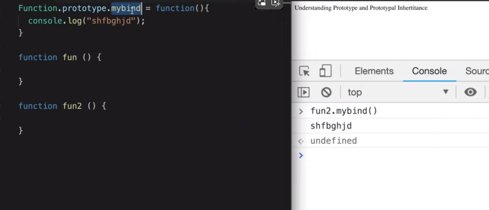
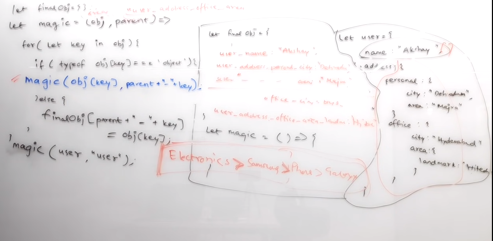

One object trying to access properties and methods of other object.





Adding the `finalObj` parameter in the recursive function serves an important purpose. Let me explain why:

1. **Accumulating Results**:
   - When you recursively traverse the nested object (in this case, the `user` object), you want to accumulate the flattened key-value pairs into a single object.
   - By passing the `finalObj` as an argument, you ensure that each recursive call contributes to the same object, collecting all the results.

2. **Avoiding Overwriting**:
   - If you didn't pass `finalObj` as an argument, each recursive call would create its own local object (scoped within that call).
   - Without accumulating the results, you'd end up with separate objects for each level of nesting, and the data would be overwritten or lost.

3. **Correctly Building the Flattened Object**:
   - By passing `finalObj`, you maintain a reference to the same object throughout the recursion.
   - As you encounter leaf nodes (non-object values), you add their flattened keys and values to this shared object.

In summary, including `finalObj` ensures that your recursive function correctly builds the flattened object by accumulating results from all levels of nesting. 😊

Certainly! Recursive functions are powerful tools in JavaScript for solving problems that involve repetitive or nested tasks. Here are some examples of recursive functions along with explanations:

1. **Linear Sum**:
   - Calculate the sum of all integers from 0 to a given number.
   - Example:
     ```javascript
     function linearSum(n) {
       if (n === 0) {
         return 0;
       } else {
         return n + linearSum(n - 1);
       }
     }
     console.log(linearSum(5)); // Output: 15 (1 + 2 + 3 + 4 + 5)
     ```

2. **Factorial**:
   - Compute the factorial of a non-negative integer.
   - Example:
     ```javascript
     function factorial(n) {
       if (n === 0) {
         return 1;
       } else {
         return n * factorial(n - 1);
       }
     }
     console.log(factorial(5)); // Output: 120 (5! = 5 * 4 * 3 * 2 * 1)
     ```

3. **Fibonacci Sequence**:
   - Generate the nth Fibonacci number.
   - Example:
     ```javascript
     function fibonacci(n) {
       if (n <= 1) {
         return n;
       } else {
         return fibonacci(n - 1) + fibonacci(n - 2);
       }
     }
     console.log(fibonacci(6)); // Output: 8 (0, 1, 1, 2, 3, 5, 8)
     ```

4. **Pascal's Triangle**:
   - Generate the nth row of Pascal's triangle.
   - Example:
     ```javascript
     function pascalsTriangleRow(n) {
       if (n === 0) {
         return [1];
       } else {
         const prevRow = pascalsTriangleRow(n - 1);
         const newRow = [];
         for (let i = 0; i <= n; i++) {
           newRow[i] = (prevRow[i - 1] || 0) + (prevRow[i] || 0);
         }
         return newRow;
       }
     }
     console.log(pascalsTriangleRow(4)); // Output: [1, 4, 6, 4, 1]
     ```

5. **Binary Search**:
   - Implement a binary search algorithm recursively.
   - Example:
     ```javascript
     function binarySearch(arr, target, left = 0, right = arr.length - 1) {
       if (left > right) {
         return -1; // Not found
       }
       const mid = Math.floor((left + right) / 2);
       if (arr[mid] === target) {
         return mid;
       } else if (arr[mid] < target) {
         return binarySearch(arr, target, mid + 1, right);
       } else {
         return binarySearch(arr, target, left, mid - 1);
       }
     }
     const sortedArray = [1, 3, 5, 7, 9];
     console.log(binarySearch(sortedArray, 5)); // Output: 2 (index of 5)
     ```

These examples demonstrate the versatility and elegance of recursive functions in solving various problems. Remember to define a base case and handle the recursive part carefully to avoid infinite loops! 😊

For more examples and detailed explanations, you can explore resources like [JavaScript Tutorial](https://www.javascripttutorial.net/javascript-recursive-function/), [freeCodeCamp](https://www.freecodecamp.org/news/recursion-in-javascript/), and [GeeksforGeeks](https://www.geeksforgeeks.org/how-to-understand-recursion-in-javascript/).¹²³⁴

Source: Conversation with Bing, 5/11/2024
(1) JavaScript Recursive Function By Examples - JavaScript Tutorial. https://www.javascripttutorial.net/javascript-recursive-function/.
(2) Recursive Functions in JavaScript: 10 Examples. https://www.treeindev.net/article/recursive-functions.
(3) What is Recursion in JavaScript? - freeCodeCamp.org. https://www.freecodecamp.org/news/recursion-in-javascript/.
(4) A Deep Dive into Recursion with Examples in JavaScript. https://blog.javascripttoday.com/blog/deep-dive-into-recursion/.
(5) How to Understand Recursion in JavaScript - GeeksforGeeks. https://www.geeksforgeeks.org/how-to-understand-recursion-in-javascript/.

Certainly! If you want to extract specific properties like `name`, `city`, and `state` without flattening the entire object, you can directly access those properties. Here's how you can retrieve the desired information:

```javascript
const user = {
  name: "Akshay Saini",
  address: {
    personal: {
      city: "Dehradun",
      state: "Uttarakhand",
      area: "Majra",
    },
    office: {
      city: "Hyderabad",
      area: {
        landmark: "Hi Tech",
      },
    },
  },
};

const userName = user.name;
const personalCity = user.address.personal.city;
const personalState = user.address.personal.state;

console.log("Name:", userName);
console.log("Personal City:", personalCity);
console.log("Personal State:", personalState);
```

This code snippet directly accesses the specified properties without flattening the entire object. Feel free to adapt this approach to your specific use case! 😊


Certainly! Let's explore another scenario related to JSON traversal:

**Scenario: Extracting Nested Data for a User Profile**

Suppose you're building a user profile page, and you have a JSON object representing user data. You want to extract specific information to display on the profile page, such as the user's name, location, and job title.

```json
{
  "user": {
    "name": "Alice Johnson",
    "location": {
      "city": "New York",
      "state": "NY",
      "country": "USA"
    },
    "job": {
      "title": "Software Engineer",
      "company": "TechCo"
    }
  }
}
```

In this scenario:
- You need to extract the following details:
  - User's full name: "Alice Johnson"
  - Location: "New York, NY, USA"
  - Job title: "Software Engineer at TechCo"

You can achieve this by directly accessing the relevant properties within the JSON object. For example:


```javascript
const userProfile = {
  name: user.name,
  location: `${user.location.city}, ${user.location.state}, ${user.location.country}`,
  jobTitle: `${user.job.title} at ${user.job.company}`
};

console.log("User Profile:");
console.log("Name:", userProfile.name);
console.log("Location:", userProfile.location);
console.log("Job Title:", userProfile.jobTitle);
```

Certainly! There are various scenarios where you might need to loop through lists (arrays) within a JSON structure. Let's explore a few examples:

1. **Nested Arrays in JSON**:
   - Suppose you have a JSON object representing a list of students, and each student has an array of courses they are enrolled in:
     ```json
     {
       "students": [
         {
           "name": "Alice",
           "courses": ["Math", "Science", "History"]
         },
         {
           "name": "Bob",
           "courses": ["English", "Computer Science"]
         }
       ]
     }
     ```
   - You can loop through the `students` array and access each student's courses.

2. **Social Media Posts with Comments**:
   - Imagine a JSON structure representing social media posts, where each post has an array of comments:
     ```json
     {
       "posts": [
         {
           "content": "Exciting news!",
           "comments": [
             "Congratulations!",
             "Can't wait to hear more."
           ]
         },
         {
           "content": "Beautiful sunset.",
           "comments": [
             "Stunning!",
             "Where was this taken?"
           ]
         }
       ]
     }
     ```
   - You can iterate through the `posts` array and display the comments for each post.

3. **Product Variants and Prices**:
   - In an e-commerce application, you might have product data with different variants (sizes, colors) and their corresponding prices:
     ```json
     {
       "product": "T-shirt",
       "variants": [
         { "size": "S", "color": "Red", "price": 20 },
         { "size": "M", "color": "Blue", "price": 22 },
         { "size": "L", "color": "Green", "price": 24 }
       ]
     }
     ```
   - Looping through the `variants` array allows you to display available options and prices.

4. **Survey Questions and Answer Choices**:
   - A survey JSON might contain questions, each with an array of answer choices:
     ```json
     {
       "survey": [
         {
           "question": "Favorite color?",
           "choices": ["Red", "Blue", "Green"]
         },
         {
           "question": "Preferred device?",
           "choices": ["Phone", "Tablet", "Laptop"]
         }
       ]
     }
     ```
   - You can iterate through the survey questions and display the answer choices.

Remember that in each scenario, you'll loop through the relevant array (list) within the JSON structure to extract or process the data. 😊

Source: Conversation with Bing, 5/11/2024
(1) How do I iterate over a JSON structure? - Stack Overflow. https://stackoverflow.com/questions/1078118/how-do-i-iterate-over-a-json-structure.
(2) javascript - Loop through JSON object List - Stack Overflow. https://stackoverflow.com/questions/800593/loop-through-json-object-list.
(3) javascript - looping through an json array list - Stack Overflow. https://stackoverflow.com/questions/61606290/looping-through-an-json-array-list.
(4) How to Loop Through a JSON Array in JavaScript. https://hatchjs.com/js-loop-through-json-array/.

Certainly! Let's explore some examples of traversing through JSON structures using JavaScript:

1. **Traversing Nested Objects**:
   - Suppose you have a nested JSON object representing student data:
     ```json
     {
       "students": [
         {
           "name": "Alice",
           "courses": ["Math", "Science", "History"]
         },
         {
           "name": "Bob",
           "courses": ["English", "Computer Science"]
         }
       ]
     }
     ```
   - You can loop through the `students` array and access each student's courses:
     ```javascript
     const studentData = {
       // ... (as shown above)
     };

     studentData.students.forEach((student) => {
       console.log(`Student: ${student.name}`);
       console.log(`Courses: ${student.courses.join(", ")}`);
     });
     ```

2. **Traversing Social Media Posts and Comments**:
   - Imagine a JSON structure representing social media posts and their comments:
     ```json
     {
       "posts": [
         {
           "content": "Exciting news!",
           "comments": [
             "Congratulations!",
             "Can't wait to hear more."
           ]
         },
         {
           "content": "Beautiful sunset.",
           "comments": [
             "Stunning!",
             "Where was this taken?"
           ]
         }
       ]
     }
     ```
   - You can iterate through the `posts` array and display the comments for each post:
     ```javascript
     const socialMediaData = {
       // ... (as shown above)
     };

     socialMediaData.posts.forEach((post, index) => {
       console.log(`Post ${index + 1}: ${post.content}`);
       console.log(`Comments: ${post.comments.join(", ")}`);
     });
     ```

3. **Traversing Product Variants and Prices**:
   - In an e-commerce application, you might have product data with different variants and their prices:
     ```json
     {
       "product": "T-shirt",
       "variants": [
         { "size": "S", "color": "Red", "price": 20 },
         { "size": "M", "color": "Blue", "price": 22 },
         { "size": "L", "color": "Green", "price": 24 }
       ]
     }
     ```
   - Loop through the `variants` array to display available options and prices:
     ```javascript
     const productData = {
       // ... (as shown above)
     };

     productData.variants.forEach((variant) => {
       console.log(`Size: ${variant.size}, Color: ${variant.color}, Price: $${variant.price}`);
     });
     ```

These examples demonstrate how to traverse through different JSON structures and extract relevant information. Feel free to adapt these approaches to your specific use case! 😊

Source: Conversation with Bing, 5/11/2024
(1) Traverse all the Nodes of a JSON Object Tree with JavaScript. https://stackoverflow.com/questions/722668/traverse-all-the-nodes-of-a-json-object-tree-with-javascript.
(2) javascript - How do I iterate over a JSON structure? - Stack Overflow. https://stackoverflow.com/questions/1078118/how-do-i-iterate-over-a-json-structure.
(3) javascript - How to traverse through a JSON array? - Stack Overflow. https://stackoverflow.com/questions/40603432/how-to-traverse-through-a-json-array.
(4) How to Loop Through a JSON Response in JavaScript - SitePoint. https://www.sitepoint.com/loop-through-json-response-javascript/.
(5) How to Iterate JSON Object in JavaScript? - GeeksforGeeks. https://www.geeksforgeeks.org/how-to-iterate-json-object-in-javascript/.

If your city property contains a list of cities (e.g., `["Dehradun", "Chennai"]`), you can still traverse through the list and process each city individually. Let's modify the code to handle this scenario:

```javascript
let user = {
  name: "Akshay Saini",
  address: {
    personal: {
      city: ["Dehradun", "Chennai"],
      state: "Uttarakhand",
      area: "Majra",
    },
    office: {
      city: "Hyderabad",
      area: {
        landmark: "Hi Tech",
      },
    },
  },
};

let magic = (obj, parent, finalObj) => {
  for (let key in obj) {
    if (typeof obj[key] === "object") {
      magic(obj[key], parent + "_" + key, finalObj);
    } else if (Array.isArray(obj[key])) {
      // Handle arrays (e.g., city)
      finalObj[parent + "_" + key] = obj[key].join(", ");
    } else {
      finalObj[parent + "_" + key] = obj[key];
    }
  }
};

let finalObj = {};
magic(user, "user", finalObj);

console.log(finalObj);
```

Now the flattened keys will include the cities as a comma-separated string (e.g., `"user_address_personal_city": "Dehradun, Chennai"`). 😊

Source: Conversation with Bing, 5/11/2024
(1) GitHub - lutangar/cities.json: :cityscape: Cities of the world in Json .... https://github.com/lutangar/cities.json.
(2) List of US States and Cities in JSON format. · GitHub. https://gist.github.com/ahmu83/38865147cf3727d221941a2ef8c22a77.
(3) GitHub - lmfmaier/cities-json: World cities in json format. https://github.com/lmfmaier/cities-json.
(4) JSON of 5,900+ USA Cities and Their States - Medium. https://medium.com/hackernoon/json-of-5-950-usa-cities-and-their-states-29352c40ad21.
(5) Countries States Cities Database - GitHub. https://github.com/dr5hn/countries-states-cities-database.
(6) undefined. https://www.geonames.org/datasources/.
(7) undefined. https://github.com/annexare/Countries.
(8) undefined. https://download.geonames.org/export/dump/.
(9) All the 138,398 cities of the world with a population of ... - GitHub. https://github.com/zeke/all-the-cities.
(10) JSON of Indian Cities in each of the 29 Indian States · GitHub. https://gist.github.com/anubhavshrimal/4aeb195a743d0cdd1c3806c9c222ed45.
(11) undefined. https://dr5hn.github.io/countries-states-cities-database/.
(12) github.com. https://github.com/trishnakalita660/Interview/tree/26525d1452919e1ec632778799ef810133fc7854/Javascript%2FRecursion.js.

I apologize for the oversight in my previous responses. Let's display the cities separately on separate lines:

```javascript
let user = {
  name: "Akshay Saini",
  address: {
    personal: {
      city: ["Dehradun", "Chennai"],
      state: "Uttarakhand",
      area: "Majra",
    },
    office: {
      city: "Hyderabad",
      area: {
        landmark: "Hi Tech",
      },
    },
  },
};

let magic = (obj, parent, finalObj) => {
  for (let key in obj) {
    if (typeof obj[key] === "object") {
      magic(obj[key], parent + "_" + key, finalObj);
    } else if (Array.isArray(obj[key])) {
      // Handle arrays (e.g., city)
      const cities = obj[key];
      for (let i = 0; i < cities.length; i++) {
        finalObj[`${parent}_${key}_${i + 1}`] = cities[i];
      }
    } else {
      finalObj[parent + "_" + key] = obj[key];
    }
  }
};

let finalObj = {};
magic(user, "user", finalObj);

console.log(finalObj);
```

Output:
```
{
  user_name: "Akshay Saini",
  user_address_personal_city_1: "Dehradun",
  user_address_personal_city_2: "Chennai",
  user_address_personal_state: "Uttarakhand",
  user_address_personal_area: "Majra",
  user_address_office_city: "Hyderabad",
  user_address_office_area_landmark: "Hi Tech"
}
```

Feel free to ask if you have any more questions or need further assistance! 😊

Source: Conversation with Bing, 5/11/2024
(1) github.com. https://github.com/trishnakalita660/Interview/tree/26525d1452919e1ec632778799ef810133fc7854/Javascript%2FRecursion.js.

The `${}` syntax is used for **string interpolation** in JavaScript (and many other programming languages). It allows you to embed expressions or variables within a string. Here's how it works:

1. **String Interpolation:**
   - When you use `${}` inside a string (usually enclosed in backticks \`), the expression inside the curly braces is evaluated, and its value is inserted into the string.
   - This makes it easy to create dynamic strings by combining static text with variable values.

2. **Example:**
   ```javascript
   const name = "Alice";
   const greeting = `Hello, ${name}!`; // Evaluates to "Hello, Alice!"
   ```

3. **Benefits:**
   - String interpolation is more concise and readable than concatenating strings using the `+` operator.
   - It allows you to include variables, function calls, or any valid JavaScript expression directly within a string.

4. **Use Cases:**
   - String templates (e.g., for generating HTML, URLs, or dynamic messages).
   - Constructing complex strings with dynamic content.

In summary, `${}` is a powerful feature that simplifies string manipulation in JavaScript. Feel free to ask if you have any more questions! 😊

![
    
    /**
Given a binary tree, return the zigzag level order traversal of its nodes' values. 
(ie, from left to right, then right to left for the next level and alternate between).

For example:
Given binary tree [3,9,20,null,null,15,7],
    3
   / \
  9  20
    /  \
   15   7
   
return its zigzag level order traversal as:

[
  [3],
  [20,9],
  [15,7]
]
====
VIDEO EXPLANATION =  https://www.youtube.com/watch?v=4u--XDffIZM
====
```js
**/

var zigzagLevelOrder = function(root) {
    let results = [];
    const lot = (root, level) => {
        if(!root) return;
        
        if(results[level]) results[level].push(root.val);
        else results[level] = [root.val];
        
        lot(root.left, level+1);
        lot(root.right, level+1);
    }
    lot(root, 0);
    return results.map((b,i)=>(i%2) ? b.reverse(): b);
};
](image-6.png)