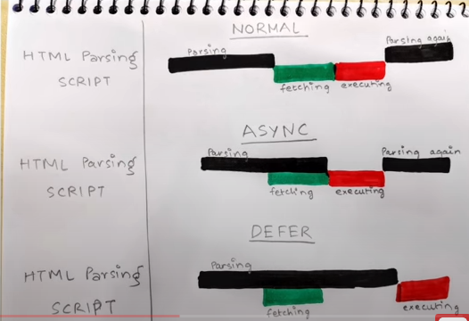

When you include external JavaScript files in your HTML document using the 
Behavior: Scripts with the async attribute are downloaded asynchronously with the rest of the webpage. As soon as the script is downloaded, it’s executed immediately, pausing the HTML parsing process.
Use Case: Ideal for scripts that don't depend on other scripts and don't modify the DOM (Document Object Model), such as analytics tracking scripts. Since async scripts can load in any order, they are not suitable for scripts that rely on or are dependencies of others.
Pros:
Doesn’t block HTML parsing while the script is being downloaded.
Can speed up page load time by downloading scripts in parallel.
Cons:
Execution order is not guaranteed; scripts execute as soon as they are downloaded.
Can cause issues if the script depends on another script or if the script needs to modify the DOM before the document is fully parsed.
defer Attribute
Usage: 
Behavior: Scripts with the defer attribute are also downloaded asynchronously, but they are executed only after the HTML document has been fully parsed.
Use Case: Suitable for scripts that need to access or modify the DOM and for scripts that depend on another script. defer ensures scripts execute in the order they appear in the document.
Pros:
Doesn’t block HTML parsing, similar to async.
Maintains execution order; scripts execute in the order they appear in the document, after the document has been parsed.
Ensures the DOM is fully built before the script is executed.
Cons:
If a script is very large, and its functionality is required to interact with the page immediately (e.g., a script that modifies the initial view), it might be better to place such scripts inline in the document or explore optimizations.
Key Differences
Execution Timing: async scripts execute as soon as they are downloaded, which can be before or after the HTML document is fully parsed. defer scripts execute in order after the HTML document is fully parsed.
Order Preservation: defer preserves the order of scripts as they appear in the document; async scripts execute in the order they are downloaded, irrespective of their order in the document.
Summary
Use async for independent scripts that do not rely on other scripts or need to wait for the DOM to be ready, such as analytics.
Use defer for scripts that need the whole document to be parsed before running, especially when script order matters.
Both async and defer are useful for improving page load performance by allowing scripts to be downloaded in parallel with HTML parsing, but their use depends on the specific needs of the scripts being loaded.

**Async/Defer**

1. HTML Parsing
2. Loading of script - fetching script, executing it

<script src=" "/>

Let's say browser is loading a webpage, browser is parsing an HTML and suddenly encounters script tag and stops parsing and fetches script from network and execute it then and there. 
after script is fetched HTML parse starts after script is executed, till then HTML is paused. Javascript is blocking the rendering of HTML.

<script async src=" "/>

While using async attribute in script tag, meanwhile the HTML parsing goes on, any of script with asycn tag are fetched from network asyncronously along with HTML parsing. HTML parsing stops,
scripts are executed then and there. once script is executed, HTML parsing continues like regular.

<script defer src=" "/>

While HTML parsing goes on, scripts are fetched in parallel from network, and the scripts executes only after HTML parsing completes.

NOTES:

1. Async attribute does not guarantee order of execution of script but defer does. If async attr in multiple script where scripts are dependent on each other.
on that case, async break the code so use defer when there are script dependencies.

2. Load some external script, independent from normal script, then use async

