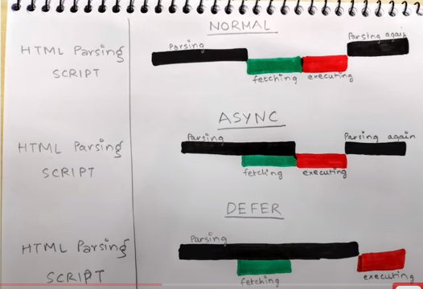

**Event Bubbling:** Bubble always comes out - bubbling out the DOM tree. From child -> parent -> grand parent   
**Event Capturing/Trickling:** Trickle down, from grand parent -> parent -> child

addEventListener('click',()=>{

},useCapture) //event, callback, useCapture(true/false)

**Event Delegation:** Delegate events to parents, instead of attach event listener to all child elements, so when child element is clicked, event will be bubbled out to parent element and callback attached to parent will be called and event handler will be triggered.

**So when we use event delegation we need to use only single event handler, saves memory, mitigates the risk of performance bottleneck, less code, DOM manipulation.**

Limitation is - all events are not bubbled up, blur, focus, scrolling not bubbled up the hierarchy, common ones like click, keyup are bubbled up. 
when stop propagation is used then the events are not bubbled up


The `document.querySelector()` method is a powerful tool in JavaScript that allows you to select elements from a web page using **CSS selectors**. Here's how it works:

- You call `document.querySelector(selector)` where `selector` is a string containing a CSS selector.
- The method returns the **first** HTML element that matches the specified selector.
- If no matches are found, it returns `null`.

For example:
- To get the first `<p>` element on the page, you can use `document.querySelector("p")`.
- To select the first element with a specific class, like `<div class="example">`, you'd use `document.querySelector(".example")`.

Keep in mind that if you want to select **all** elements that match a selector (not just the first one), you can use `document.querySelectorAll(selector)` instead. Both methods throw a `SYNTAX_ERR` exception if the selector is invalid¹²³⁴⁵.

Feel free to ask if you need more information or have any other questions! üòä

Source: Conversation with Bing, 5/11/2024
(1) HTML DOM Document querySelector() Method - W3Schools. https://www.w3schools.com/jsref/met_document_queryselector.asp.
(2) How to use the querySelector method in javascript.. https://jools.dev/how-to-use-document-queryselector-in-javascript.
(3) Document.querySelector - selecting elements with querySelector - ZetCode. https://zetcode.com/javascript/queryselector/.
(4) JavaScript querySelector() - JavaScript Guide. https://javascriptguide.com/document-queryselector/.
(5) Document: querySelector() method - Web APIs | MDN - MDN Web Docs. https://developer.mozilla.org/en-US/docs/Web/API/Document/querySelector.

Certainly! Event delegation is a powerful technique in JavaScript that allows you to handle events more efficiently by attaching a single event listener to a parent element, rather than adding individual listeners to multiple child elements. Let's dive into the details:

1. **Event Bubbling and Event Delegation**:
   - Event delegation relies on the concept of **event bubbling**. When an event occurs on an element, it propagates up the DOM tree from the target element to its ancestors.
   - If an event bubbles (which is the case for most events like `click`, `keyup`, etc.), it means that the event travels upward through the DOM hierarchy.
   - Event delegation leverages this bubbling behavior to handle events at a higher level (usually a parent or ancestor element) rather than attaching listeners to individual child elements.

2. **Events That Don't Bubble Up**:
   While most events bubble up, there are a few exceptions where they do not propagate to parent elements:
   - **Focus and Blur Events**: The `focus` and `blur` events do not bubble. They only trigger on the element that directly receives or loses focus.
   - **Scroll Events**: The `scroll` event does not bubble either. It only occurs on the element that is being scrolled (usually the `window` or a scrollable container).
   - **Load and Unload Events**: The `load` and `unload` events (e.g., for images, iframes, or the entire page) do not bubble. They occur directly on the loaded or unloaded element.
   - **Change and Input Events**: The `change` and `input` events do not bubble consistently across all browsers. They behave differently depending on the type of input element (e.g., text input, checkbox, select).

3. **Handling Non-Bubbling Events**:
   - For non-bubbling events, you have a few options:
     - Attach the event listener directly to the specific element where the event occurs (e.g., attach a `focus` listener to an input field).
     - Use event delegation with a bubbling parent element, but be aware that you won't catch these specific events unless they happen on the parent itself.
     - For `scroll` events, consider using the `window` object or a specific scrollable container as the target for your listener.

4. **Example of Event Delegation**:
   Let's say you have a list of items, and you want to handle clicks on any of the list items. Instead of adding individual click listeners to each item, you can use event delegation:

   ```html
   <ul id="myList">
     <li>Item 1</li>
     <li>Item 2</li>
     <li>Item 3</li>
   </ul>
   ```

   ```javascript
   const myList = document.getElementById('myList');

   myList.addEventListener('click', (event) => {
     if (event.target.tagName === 'LI') {
       // Handle the click on the list item
       console.log(`Clicked on ${event.target.textContent}`);
     }
   });
   ```

   In this example, the click event bubbles up from the clicked list item to the `ul` element, where we handle it. We check if the clicked element is an `LI` (list item) before performing any action.

5. **Conclusion**:
   - Event delegation is a powerful technique for improving performance and maintaining cleaner code.
   - Be aware of non-bubbling events and choose the appropriate approach based on your use case.

Remember that event delegation is especially useful when dealing with dynamically added or removed elements, as you don't need to reattach listeners every time the DOM changes. üòä

If you have any more questions or need further clarification, feel free to ask! üåü

Source: Conversation with Bing, 5/11/2024
(1) Event Delegation in JavaScript - Better Programming. https://betterprogramming.pub/event-delegation-in-javascript-boost-your-app-performance-5f10f25cec96.
(2) HTML DOM: why do some of the events don't bubble up during event delegation. https://stackoverflow.com/questions/67847126/html-dom-why-do-some-of-the-events-dont-bubble-up-during-event-delegation.
(3) Event Delegation in JavaScript: Complete Guide - codedamn. https://codedamn.com/news/javascript/event-delegation-in-javascript-complete-guide.
Certainly! Event delegation is a powerful technique for handling events more efficiently, especially when dealing with dynamically added or removed elements. While the `focus` and `blur` events themselves do not bubble consistently across all browsers, you can work around this limitation using the `focusin` and `focusout` events, which do support event bubbling⁵⁶.

Here's how you can handle `focus` and `blur` events using event delegation:

1. **Focusin and Focusout Events**:
   - The `focusin` event is sent to an element when it (or any element inside it) gains focus. It supports detecting the focus event on parent elements, making it suitable for event delegation.
   - The `focusout` event is similar but triggers when an element (or its descendant) loses focus.
   - Both `focusin` and `focusout` events bubble up the DOM hierarchy, allowing you to delegate them to a common ancestor element.

2. **Example Using jQuery**:
   Let's say you have an HTML structure like this:

   ```html
   <div id="myContainer">
     <input type="text" placeholder="Enter your name">
     <!-- Other elements here -->
   </div>
   ```

   You can handle the `focusin` and `focusout` events for the input field using event delegation:

   ```javascript
   // Attach the event handler to the common ancestor (myContainer)
   $('#myContainer').on('focusin focusout', 'input[type="text"]', function(event) {
     if (event.type === 'focusin') {
       // Handle focus (element gained focus)
       console.log('Input field focused');
     } else if (event.type === 'focusout') {
       // Handle blur (element lost focus)
       console.log('Input field blurred');
     }
   });
   ```

   In this example:
   - The event handler is attached to the `#myContainer` element.
   - The selector `'input[type="text"]'` ensures that only input fields trigger the event.
   - You can replace the `console.log` statements with your custom logic.

3. **Native JavaScript Approach**:
   If you prefer using native JavaScript without jQuery, you can achieve the same result:

   ```javascript
   const myContainer = document.getElementById('myContainer');

   myContainer.addEventListener('focusin', (event) => {
     if (event.target.tagName === 'INPUT' && event.target.type === 'text') {
       // Handle focus
       console.log('Input field focused');
     }
   });

   myContainer.addEventListener('focusout', (event) => {
     if (event.target.tagName === 'INPUT' && event.target.type === 'text') {
       // Handle blur
       console.log('Input field blurred');
     }
   });
   ```

4. **Remember**:
   - Use `focusin` and `focusout` for event delegation, as they bubble.
   - Avoid relying solely on `focus` and `blur` events for delegation due to their inconsistent behavior across browsers.

Feel free to adapt this approach to your specific use case, and let me know if you need further assistance! üòä

Source: Conversation with Bing, 5/11/2024
(1) Focus and blur jQuery events not bubbling - Stack Overflow. https://stackoverflow.com/questions/9577971/focus-and-blur-jquery-events-not-bubbling.
(2) Events - blur and focus. http://www.quirksmode.org/dom/events/blurfocus.html.
(3) jquery - How to delegate focus event? - Stack Overflow. https://stackoverflow.com/questions/14496083/how-to-delegate-focus-event.
(4) focus - Event reference | MDN. http://devdoc.net/web/developer.mozilla.org/en-US/docs/Web/Reference/Events/focus.html.
(5) JavaScript Event Delegation is Easier than You Think. https://www.sitepoint.com/javascript-event-delegation-is-easier-than-you-think/.
(6) javascript - How to get the focus event following the blur event .... https://stackoverflow.com/questions/1378066/how-to-get-the-focus-event-following-the-blur-event.
(7) Delegating the focus and blur events - QuirksBlog. http://www.quirksmode.org/blog/archives/2008/04/delegating_the.html.
(8) Why event.bubbles is false for "focusin" and "focusout"?. https://stackoverflow.com/questions/10584488/why-event-bubbles-is-false-for-focusin-and-focusout.
Certainly! Let's compare `document.getElementById('myContainer')` with `document.querySelector('#myContainer')`:

1. **getElementById**:
   - The `getElementById` method is a classic and straightforward way to retrieve an element from the DOM by its unique **ID**.
   - It specifically targets an element with a matching ID attribute.
   - Example:
     ```javascript
     const myContainer = document.getElementById('myContainer');
     ```
   - **Pros**:
     - Simple and efficient when you know the exact ID.
     - Supported in all browsers.
   - **Cons**:
     - Limited to selecting elements by their IDs only.

2. **querySelector**:
   - The `querySelector` method allows you to select elements using **CSS selectors**.
   - It's more versatile and flexible than `getElementById`.
   - Example:
     ```javascript
     const myContainer = document.querySelector('#myContainer');
     ```
   - **Pros**:
     - Supports complex selectors (e.g., class names, attribute values, pseudo-selectors).
     - Works with any valid CSS selector.
     - Can be used from any element context (not just the document).
   - **Cons**:
     - Slightly slower than `getElementById` due to the selector parsing process.
     - Supported in modern browsers (which is not an issue today).

3. **When to Use Which**:
   - Use `getElementById` when you know the specific ID and want a simple way to retrieve an element.
   - Use `querySelector` when:
     - You need to select elements based on more complex rules (e.g., class names, attributes).
     - You want to leverage the power of CSS selectors.
     - You're working with dynamically generated content or nested elements.

In summary:
- If you're targeting an element by its ID, both methods work, but `getElementById` is more direct.
- If you need flexibility or want to use complex selectors, go with `querySelector`.

Feel free to choose the method that best suits your use case! üòä

Source: Conversation with Bing, 5/11/2024
(1) javascript - querySelector vs. getElementById - Stack Overflow. https://stackoverflow.com/questions/26848289/queryselector-vs-getelementbyid.
(2) document.queryselector vs document.getelementbyid | Code Ease. https://www.codeease.net/programming/javascript/document-queryselector-vs-document-getelementbyid.
(3) querySelector vs. getElementById: A Comparison | Career Karma. https://careerkarma.com/blog/javascript-queryselector-vs-getelementbyid/.
(4) Understanding JavaScript DOM Element Selection: querySelector vs .... https://medium.com/@rahulsharmaah/understanding-javascript-dom-element-selection-queryselector-vs-getelementbyid-24b6aa3b8007.

The limitation with event delegation lies in the fact that **not all events bubble up** through the DOM hierarchy. Let's explore why some events, including `focus`, `blur`, and `scroll`, cannot be effectively handled using event delegation:

1. **Focus and Blur Events**:
   - The `focus` and `blur` events are used to detect when an element gains or loses focus, respectively.
   - Unfortunately, these events do **not** consistently bubble up across all browsers. Specifically:
     - In Internet Explorer, the `focus` event does **not** bubble.
     - Other modern browsers do not consistently support bubbling for `focus` and `blur`.
   - As a result, scripts relying on event delegation with the `focus` event may not work consistently across different browsers¬π‚Å¥.
   - However, jQuery provides a workaround by mapping `focus` to the `focusin` event in its event delegation methods (such as `.on()` and `.delegate()`)¬π.

2. **Scroll Events**:
   - The `scroll` event occurs when an element is scrolled (e.g., scrolling a webpage or a scrollable container).
   - Unfortunately, the `scroll` event does **not** bubble up the DOM hierarchy.
   - To handle scroll events, you typically attach listeners directly to the specific scrollable element (e.g., the `window` or a scrollable container).

3. **Event Delegation Challenges**:
   - When an event doesn't bubble, it becomes challenging to use event delegation effectively.
   - Event delegation relies on the bubbling behavior to handle events at a higher level (usually a parent or ancestor element) rather than attaching listeners to individual child elements.
   - Since `focus`, `blur`, and `scroll` events don't bubble consistently, delegating them becomes less straightforward.

4. **Alternative Approaches**:
   - For non-bubbling events like `focus` and `blur`, consider attaching event listeners directly to the specific elements where these events occur.
   - For scroll events, directly attach listeners to the scrollable elements (e.g., `window`, scrollable containers).
   - Remember that event delegation is most effective for events that reliably bubble (e.g., `click`, `keyup`, etc.).

In summary, while event delegation is a powerful technique, it has limitations due to the behavior of specific events. Understanding which events bubble and which don't helps you choose the right approach for handling events in your application².

Feel free to ask if you have any more questions or need further clarification! üòä

Source: Conversation with Bing, 5/11/2024
(1) Focus and blur jQuery events not bubbling - Stack Overflow. https://stackoverflow.com/questions/9577971/focus-and-blur-jquery-events-not-bubbling.
(2) jquery - How to delegate focus event? - Stack Overflow. https://stackoverflow.com/questions/14496083/how-to-delegate-focus-event.
(3) Event Delegation in JavaScript - Better Programming. https://betterprogramming.pub/event-delegation-in-javascript-boost-your-app-performance-5f10f25cec96.
(4) Delegating the focus and blur events - QuirksBlog. https://www.quirksmode.org/blog/archives/2008/04/delegating_the.html.

Handling scroll events using event delegation can be tricky due to the nature of the `scroll` event, which does not consistently bubble up through the DOM hierarchy. However, I'll provide some alternative approaches and workarounds:

1. **Directly Attach Scroll Event to Window or Scrollable Containers**:
   - Typically, you handle scroll events on the `window` object to track the overall page scroll. You can also attach scroll event listeners to specific scrollable containers within your page.
   - Example using the `window` object:
     ```javascript
     window.addEventListener('scroll', (event) => {
       console.log('Scrolling...');
       // Your custom logic here
     });
     ```
   - If you have a specific scrollable container (e.g., a div with a fixed height and `overflow: auto`), attach the event listener to that container instead.

2. **Use Intersection Observer**:
   - The Intersection Observer API is a powerful tool for efficiently handling scroll-related events, especially when dealing with lazy loading, infinite scrolling, or tracking elements entering/exiting the viewport.
   - It allows you to observe changes in the visibility of elements relative to a container or the viewport.
   - Example:
     ```javascript
     const observer = new IntersectionObserver((entries) => {
       entries.forEach((entry) => {
         if (entry.isIntersecting) {
           // Element is in the viewport
           console.log('Element is visible:', entry.target);
           // Your custom logic here
         }
       });
     });

     // Observe a specific element
     const targetElement = document.querySelector('#myTargetElement');
     observer.observe(targetElement);
     ```

3. **Debouncing or Throttling**:
   - When handling scroll events, consider debouncing or throttling your event handler to improve performance.
   - Debouncing ensures that your handler is called only after a certain delay (e.g., 300ms) since the last scroll event.
   - Throttling limits the frequency of calls (e.g., every 100ms) regardless of how fast the user scrolls.
   - Libraries like Lodash provide utility functions for debouncing and throttling.

4. **Combining Event Delegation with Other Events**:
   - While direct event delegation for scroll events is limited, you can combine it with other events.
   - For example, you can delegate a click event to a parent container and then check if the clicked element is a scroll-related control (e.g., a button to scroll to the top).
   - Handle the scroll behavior directly based on the clicked element.

5. **Avoid Overusing Scroll Event Handlers**:
   - Be mindful of performance implications when attaching scroll event listeners.
   - If you have many scrollable elements, consider attaching listeners only to the necessary ones.
   - Optimize your code to avoid unnecessary calculations during scroll events.

Remember that the choice of approach depends on your specific use case. Whether you directly attach scroll events or use other techniques, aim for efficiency and maintainability in your code. üòä

If you need further assistance or have more questions, feel free to ask! üåü
[1](https://betterprogramming.pub/event-delegation-in-javascript-boost-your-app-performance-5f10f25cec96) [2](https://javascript.info/event-delegation) [3](https://www.freecodecamp.org/news/event-delegation-javascript/) [4](https://www.javascripttutorial.net/javascript-dom/javascript-scroll-events/)

Source: Conversation with Bing, 5/11/2024
(1) Event Delegation in JavaScript - Better Programming. https://betterprogramming.pub/event-delegation-in-javascript-boost-your-app-performance-5f10f25cec96.
(2) Event delegation - The Modern JavaScript Tutorial. https://javascript.info/event-delegation.
(3) Event Delegation in JavaScript –Explained with an Example. https://www.freecodecamp.org/news/event-delegation-javascript/.
(4) JavaScript Scroll Events, Event Throttling & Passive Events. https://www.javascripttutorial.net/javascript-dom/javascript-scroll-events/.

**Lazy loading** (also known as **asynchronous loading**) is an optimization technique used in web design and web development. Its purpose is to **defer the initialization of an object** (such as images, scripts, or other resources) until it is actually needed by the user. Here's how it works:

1. **Concept**:
   - Instead of loading the **entire web page** and rendering it all at once (as in bulk loading), lazy loading assists in loading only the **required sections** initially.
   - The remaining content is **delayed** until the user interacts with or requests it.
   - For example, consider a webpage with multiple images. Instead of loading all images upfront (which might not be seen by the user), lazy loading ensures that only the visible images are loaded initially.

2. **Advantages**:
   - **Reduced Time and Memory Consumption**: Lazy loading optimizes content delivery by loading only what's needed. This reduces the time taken for initial page load and saves memory.
   - **Enhanced User Experience**: Users get the requested content quickly, improving their overall experience.
   - **Avoids Unnecessary Code Execution**: Only relevant resources are loaded, avoiding unnecessary execution of code.
   - **Cost-Effective for Businesses**: Efficient use of time and space resources benefits website owners.

3. **Disadvantages**:
   - **Code Complexity**: Implementing lazy loading requires additional lines of code, which can make the codebase more complex.
   - **Search Engine Ranking Impact**: Improper indexing of unloaded content may affect a website's ranking on search engines.

In summary, while lazy loading has some pitfalls, its benefits—such as optimal resource utilization—outweigh the drawbacks. It's a valuable technique for improving web performance and user satisfaction¹²³⁴. 😊
[1](https://www.geeksforgeeks.org/what-is-lazy-loading/) [2](https://en.wikipedia.org/wiki/Lazy_loading) [3](https://www.sanity.io/glossary/lazy-loading) [4](https://developer.mozilla.org/en-US/docs/Web/Performance/Lazy_loading)

Source: Conversation with Bing, 5/11/2024
(1) What is Lazy Loading? - GeeksforGeeks. https://www.geeksforgeeks.org/what-is-lazy-loading/.
(2) Lazy loading - Wikipedia. https://en.wikipedia.org/wiki/Lazy_loading.
(3) What is Lazy Loading? | Definition - Glossary. https://www.sanity.io/glossary/lazy-loading.
(4) Lazy loading - Web performance | MDN - MDN Web Docs. https://developer.mozilla.org/en-US/docs/Web/Performance/Lazy_loading.

Certainly! **Progressive rendering** is a web optimization technique that focuses on improving the perceived loading time of a webpage by prioritizing the loading and display of essential content. Let's dive into the details:

1. **What Is Progressive Rendering?**
   - **Rendering** refers to the process of converting code (HTML, CSS, and JavaScript) into an interactive webpage that users can see and interact with.
   - **Progressive rendering** involves rendering a webpage in a way that prioritizes high-priority components first and progressively loads less critical components afterward.
   - The goal is to make the webpage usable as quickly as possible, even before all resources are fully loaded.

2. **Comparison with Server-Side Rendering (SSR) and Client-Side Rendering (CSR)**:
   - **Client-Side Rendering (CSR)**:
     - In CSR, content is rendered on the client side.
     - When a user visits a webpage, the browser requests HTML and CSS files from the server.
     - The browser then waits for the JavaScript (JS) file to load before displaying the content.
     - Until the JS file is loaded, users see a blank page.
   - **Server-Side Rendering (SSR)**:
     - In SSR, content is first rendered on the server side.
     - The server processes HTML and CSS files and sends the processed webpage to the client.
     - Users can see the webpage immediately, but interaction (e.g., form submissions) requires JS.
     - SSR is faster than CSR because the initial content is visible without waiting for JS.

3. **Benefits of Progressive Rendering**:
   - **Improved Load Time**:
     - By loading critical content first, progressive rendering reduces the time users spend waiting for the page to become usable.
     - Users can start interacting with the page sooner, even on slower internet connections or mobile devices.
   - **Optimized Critical Rendering Path**:
     - The critical rendering path refers to the steps between receiving HTML, CSS, and JS code and converting them into a visual webpage.
     - Progressive rendering ensures that these critical steps are optimized for faster rendering.
   - **Enhanced User Experience**:
     - Faster loading speed leads to a better overall user experience.
     - Users can engage more with websites, especially when content appears quickly.

In summary, progressive rendering is a valuable technique for making web pages feel responsive and user-friendly, especially during initial loading. It balances the need for immediate usability with the eventual loading of non-critical components¹²³. 😊
[1](https://www.geeksforgeeks.org/what-is-progressive-rendering/) [2](https://cloudinary.com/glossary/progressive-rendering) [3](https://www.tutorialspoint.com/what-is-progressive-rendering)

Source: Conversation with Bing, 5/11/2024
(1) What is progressive rendering ? - GeeksforGeeks. https://www.geeksforgeeks.org/what-is-progressive-rendering/.
(2) Progressive Rendering | Cloudinary. https://cloudinary.com/glossary/progressive-rendering.
(3) What is Progressive Rendering? - Online Tutorials Library. https://www.tutorialspoint.com/what-is-progressive-rendering.
(4) Progressive Rendering — The Key to Faster Web - Medium. https://medium.com/the-thinkmill/progressive-rendering-the-key-to-faster-web-ebfbbece41a4.

Certainly! Implementing **progressive rendering** in your web application can significantly improve user experience and page load times. Let's explore a few approaches:

1. **Lazy Loading for Images**:
   - Lazy loading delays the loading of images until they are visible in the user's viewport.
   - Use the `loading="lazy"` attribute on your `` tags to enable native lazy loading.
   - Alternatively, you can use JavaScript libraries (e.g., `lozad.js`, `lazysizes`) to handle lazy loading programmatically.

2. **Prioritize Above-the-Fold Content**:
   - Load critical content (above-the-fold) first to make the initial page view usable.
   - Prioritize rendering elements that appear in the user's viewport without requiring scrolling.
   - Defer loading non-critical content (e.g., scripts, stylesheets) until after the initial rendering.

3. **Use Placeholders for Non-Essential Elements**:
   - While waiting for content to load, display placeholders (skeleton screens) to maintain the layout.
   - These placeholders give users a sense of progress and prevent layout shifts.

4. **Server-Side Rendering (SSR)**:
   - SSR renders the entire HTML on the server and sends it to the client.
   - Frameworks like Next.js and Gatsby support SSR.
   - Consider using SSR for critical pages or components.

5. **Progressive Enhancement**:
   - Start with a basic HTML structure and enhance it with CSS and JavaScript.
   - Ensure that essential functionality works even without JavaScript (e.g., forms, navigation).

6. **Optimize Critical Rendering Path**:
   - Minimize render-blocking resources (CSS and JavaScript).
   - Use async/defer attributes for script tags to avoid blocking rendering.
   - Optimize CSS delivery (critical CSS, inlining, etc.).

7. **Measure and Optimize**:
   - Use browser developer tools (e.g., Chrome DevTools) to analyze rendering performance.
   - Monitor metrics like First Contentful Paint (FCP), Largest Contentful Paint (LCP), and Time to Interactive (TTI).
   - Continuously optimize based on real-world data.

Remember that progressive rendering is an ongoing process. Regularly review and improve your implementation to ensure a smooth user experience. üòä

If you'd like more specific examples or need further guidance, feel free to ask! üåü
[1](https://medium.com/the-thinkmill/progressive-rendering-the-key-to-faster-web-ebfbbece41a4) [2](https://cloudinary.com/glossary/progressive-rendering) [3](https://www.geeksforgeeks.org/what-is-progressive-rendering/) [4](https://blog.bitsrc.io/progressive-rendering-for-better-web-app-performance-22db0d2cd80)

Source: Conversation with Bing, 5/11/2024
(1) How to develop a Progressive Web App using ReactJS - GeeksforGeeks. https://www.geeksforgeeks.org/how-to-develop-a-progressive-web-app-using-reactjs/.
(2) What is progressive rendering? | The Frontend Web Developer Blog .... https://pixelrocket.store/blog/what-is-progressive-rendering.
(3) Progressive Rendering | Cloudinary. https://cloudinary.com/glossary/progressive-rendering.
(4) How To Build Progressive Web Apps with Angular | DigitalOcean. https://www.digitalocean.com/community/tutorials/how-to-build-progressive-web-apps-with-angular.
(5) Making a Progressive Web App | Create React App. https://create-react-app.dev/docs/making-a-progressive-web-app/.
(6) Progressive Rendering — The Key to Faster Web - Medium. https://medium.com/the-thinkmill/progressive-rendering-the-key-to-faster-web-ebfbbece41a4.
(7) What is progressive rendering ? - GeeksforGeeks. https://www.geeksforgeeks.org/what-is-progressive-rendering/.
(8) Progressive Rendering for Better Web App Performance. https://blog.bitsrc.io/progressive-rendering-for-better-web-app-performance-22db0d2cd80.

Certainly! You can implement lazy loading for images using the native HTML `loading` attribute. This attribute allows you to defer the loading of off-screen images until they are needed, improving page load times and overall performance. Here's how you can do it:

1. **Using the `loading` Attribute**:
   - Add the `loading` attribute to your `` tags and set its value to `"lazy"`:
     ```html
     
     ```
   - This tells the browser to load the image lazily, i.e., only when it's close to the viewport (visible area).

2. **Supported Values for the `loading` Attribute**:
   - `lazy`: Defer loading of the resource until it reaches a calculated distance from the viewport.
   - `eager`: Default loading behavior of the browser (same as not including the attribute), which loads the image regardless of its position on the page.

3. **Additional Recommendations**:
   - To avoid layout shifts, add `width` and `height` attributes or specify their values directly in an inline style:
     ```html
     
     ```

By using the `loading` attribute, you can achieve lazy loading without writing custom JavaScript code or relying on external libraries. It's a simple and effective way to improve performance! üòä

For more details, you can refer to the [official documentation](https://web.dev/articles/browser-level-image-lazy-loading).¹²³

Source: Conversation with Bing, 5/11/2024
(1) Browser-level image lazy loading for the web. https://web.dev/articles/browser-level-image-lazy-loading.
(2) How to lazy load images and iframes with the native HTML loading attribute. https://gomakethings.com/how-to-lazy-load-images-and-iframes-with-the-native-html-loading-attribute/.
(3) How to Lazy Load Images Natively in HTML - Webtips. https://webtips.dev/webtips/html/how-to-lazy-load-images-natively-in-html.
(4) Lazy loading - Web performance | MDN - MDN Web Docs. https://developer.mozilla.org/en-US/docs/Web/Performance/Lazy_loading.
(5) HTML img loading Attribute - W3Schools. https://bing.com/search?q=implement+lazy+loading+for+images+using+native+HTML+attributes.
(6) How lazy loading images using JavaScript works? - Stack Overflow. https://stackoverflow.com/questions/9667631/how-lazy-loading-images-using-javascript-works.

Certainly! You can implement lazy loading for images using the native HTML `loading` attribute. This attribute allows you to defer the loading of off-screen images until they are needed, improving page load times and overall performance. Here's how you can do it:

1. **Using the `loading` Attribute**:
   - Add the `loading` attribute to your `` tags and set its value to `"lazy"`:
     ```html
     
     ```
   - This tells the browser to load the image lazily, i.e., only when it's close to the viewport (visible area).

2. **Supported Values for the `loading` Attribute**:
   - `lazy`: Defer loading of the resource until it reaches a calculated distance from the viewport.
   - `eager`: Default loading behavior of the browser (same as not including the attribute), which loads the image regardless of its position on the page.

3. **Additional Recommendations**:
   - To avoid layout shifts, add `width` and `height` attributes or specify their values directly in an inline style:
     ```html
     
     ```

By using the `loading` attribute, you can achieve lazy loading without writing custom JavaScript code or relying on external libraries. It's a simple and effective way to improve performance! üòä

For more details, you can refer to the [official documentation](https://web.dev/articles/browser-level-image-lazy-loading).¹²³

Source: Conversation with Bing, 5/11/2024
(1) Browser-level image lazy loading for the web. https://web.dev/articles/browser-level-image-lazy-loading.
(2) How to lazy load images and iframes with the native HTML loading attribute. https://gomakethings.com/how-to-lazy-load-images-and-iframes-with-the-native-html-loading-attribute/.
(3) How to Lazy Load Images Natively in HTML - Webtips. https://webtips.dev/webtips/html/how-to-lazy-load-images-natively-in-html.
(4) Lazy loading - Web performance | MDN - MDN Web Docs. https://developer.mozilla.org/en-US/docs/Web/Performance/Lazy_loading.
(5) HTML img loading Attribute - W3Schools. https://bing.com/search?q=implement+lazy+loading+for+images+using+native+HTML+attributes.
(6) How lazy loading images using JavaScript works? - Stack Overflow. https://stackoverflow.com/questions/9667631/how-lazy-loading-images-using-javascript-works.

Certainly! **Responsive images** play a crucial role in creating a seamless web experience across various devices and screen sizes. Let's explore some techniques and their benefits:

1. **What Are Responsive Images?**
   - Responsive images adjust their size and resolution based on the device or screen they are viewed on.
   - They ensure that images look sharp and clear, whether displayed on a small smartphone screen or a large desktop monitor.
   - Achieving this involves using different versions of the same image with varying resolutions and serving the appropriate version based on the screen size.

2. **Benefits of Using Responsive Images**:
   - **Increased Loading Speed**:
     - By serving optimized images appropriate for each device's size and resolution, responsive images improve loading speed.
     - Smaller image sizes lead to faster loading times, enhancing the overall user experience.
   - **Better User Experience**:
     - Responsive images ensure that images remain readable and visually appealing on any device.
     - This is especially critical for mobile users, who may leave a website if it loads slowly or displays poorly optimized images.
   - **Stronger SEO**:
     - Lower bounce rates (the number of visitors leaving after viewing only one page) can improve a website's search engine rankings.
     - Responsive images contribute to a better user experience, indirectly benefiting SEO.

3. **Techniques for Implementing Responsive Images**:
   - **HTML Attributes: `srcset` and `sizes`**:
     - The `srcset` attribute specifies different image versions and their respective widths.
     - The `sizes` attribute defines the image sizes relative to the viewport width.
     - Together, they allow browsers to choose the appropriate image based on the user's device¬π.
   - **The `<picture>` Element**:
     - The `<picture>` element lets you provide multiple sources for an image.
     - You can include different formats (e.g., WebP, JPEG) or resolutions within the `<picture>` element.
     - Browsers select the most suitable source based on the user's device and browser support².
   - **Optimizing Image Formats**:
     - Choose the right image format (e.g., WebP, JPEG, PNG) based on the content and browser support.
     - Modern formats like WebP offer better compression and quality.
   - **Lazy Loading**:
     - Use the `loading="lazy"` attribute on `` tags to defer loading of off-screen images until they are needed.
     - This improves initial page load times and conserves data³.

4. **Conclusion**:
   - Mastering responsive images ensures a visually appealing web experience while maintaining efficient load times.
   - By implementing these techniques, you can create websites that look fantastic on any device.

Remember to adapt these techniques to your specific project requirements and keep optimizing for better performance! üòä
[1](https://cloudinary.com/guides/responsive-images/what-are-responsive-images-and-6-useful-techniques) [2](https://codeit.mk/home/blog/Responsive-Images--Techniques-and-Best-Practices) [3](https://www.techzone360.com/topics/techzone/articles/2023/11/15/457728-4-easy-responsive-image-techniques.htm)

Source: Conversation with Bing, 5/11/2024
(1) What Are Responsive Images and 6 Useful Techniques. https://cloudinary.com/guides/responsive-images/what-are-responsive-images-and-6-useful-techniques.
(2) Responsive Images: Techniques and Best Practices. https://codeit.mk/home/blog/Responsive-Images--Techniques-and-Best-Practices.
(3) 4 Easy Responsive Image Techniques - techzone360.com. https://www.techzone360.com/topics/techzone/articles/2023/11/15/457728-4-easy-responsive-image-techniques.htm.
(4) Responsive Images with CSS: Techniques and Best Practices - codedamn. https://codedamn.com/news/frontend/responsive-images-css.