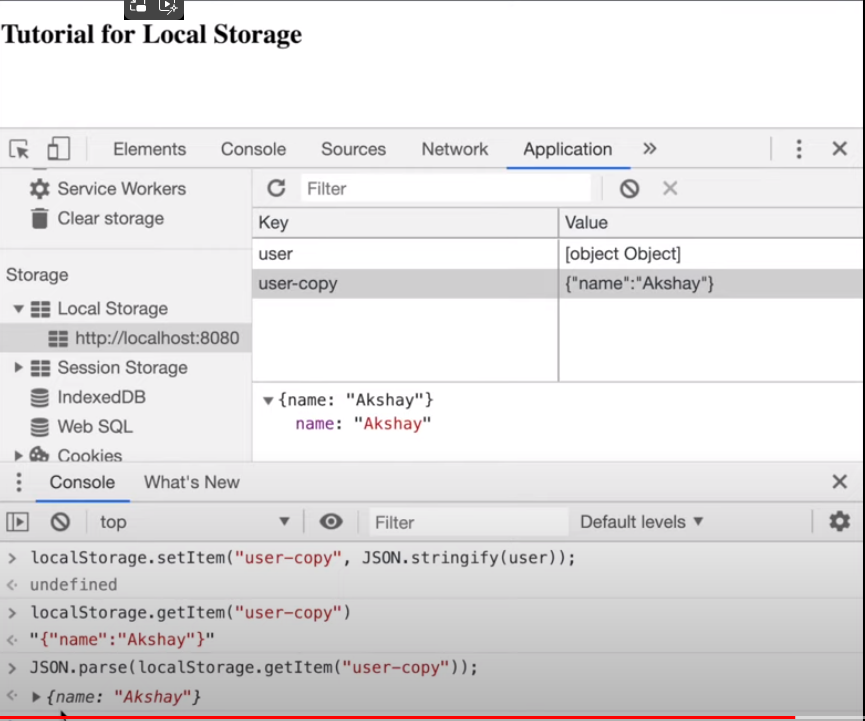
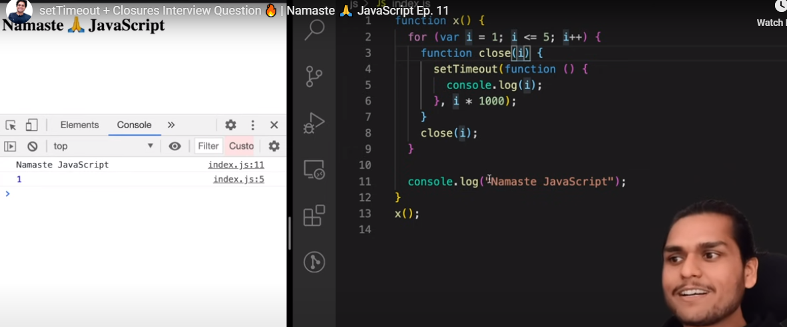

 Understanding Web Storage API including, localStorage and sessionStorage
- Explaining how companies like Flipkart and Paytm use Local Storage
- How can this will help you in Machine Coding Round of your Web/UI developer Interview
- Code Example for how to use Local Storage functions

If interested, also check out other videos in “Cracking the Frontend Interview” Series here:   

 • How to prepare for Web Developer Inte...  

Web Storage APIs are used by developers to store data into the browser. Now the data here refers to the key-value pair of strings. Now storing this data can be done by 2 mechanisms: either by using the sessionStorage API and the localStorage API.

So in session storage, the data is stored in the browser’s memory for that specific session. Session more here means until you close the browser window. Unlike cookies, the data in sessionStorage is never transferred to the server while making a network request. 

The storage limit of session storage is also very high when compared to cookies. The cookies which can generally store around 4000 bytes of data here session storage can store at least 5 MB of data or even more than that depending on the device and browser. Which is a lot!

If we talk about localStorage, it is almost the same as the session storage but the major difference is that it does not have an expiry. So Even if you close the browser and restart your system and come back again anytime the data persists. That makes it unique and very useful. And among these 3, localStorage has higher memory limit.

It’s used a lot even by many big companies to store some less relevant user-specific data into their browsers. Some companies even use it to optimize the performance of the web page speed as access localStorage is faster than making a request to the server and getting the data.

If you have ever observed many companies like Flipkart and Paytm use localStorage for keeping a lot of data. Flipkart. If you go and check the application tab of your developer console. Then you’ll find out that some information such as browsed products, navigation menu, autosuggest history all this user-specific data is being stored in the local storage.

And if you go and check the localStorage for Paytm you’ll also find that even they store a lot of data such as the recent searches for flights, recent cities you selected and even some session data into localStorage.

One more important thing to note here is that due to security reasons it follows the same-origin policy. Same-Origin refers to the same Protocol, same host, and the same port. 

Later half of the video also contains the code demo for the localStorage APIs which you can use to get data, set data or clear data from the storage.

And towards the end, I also share my tips which you can use before your Machine Coding Round of the Interview and can save a lot of time. 




https://github.com/NarendraKoya999/Frontend-Machine-Coding-Interview-Questions
https://github.com/ghoshsuman845/frontend-interview-preparation-kit
https://javascriptpatterns.vercel.app/patterns/react-patterns/higher-order-component

Certainly! Let's dive into closures in JavaScript and explore how they relate to the problem you provided.

1. **What Is a Closure?**
    - A **closure** is the combination of a function bundled together (enclosed) with references to its surrounding state (the lexical environment).
    - In simpler terms, a closure allows an inner function to access variables from its outer function, even after the outer function has finished executing.
    - Closures are automatically created every time a function is defined in JavaScript¹.

2. **Lexical Scoping and Nested Functions**:
    - Lexical scoping refers to how a parser resolves variable names when functions are nested.
    - When you create an inner function inside an outer function, the inner function forms a closure and can access variables declared in the outer function.
    - The location where a variable is declared within the source code determines where that variable is available.
    - In the example below, the `displayName()` function accesses the `name` variable declared in its parent function, `init()`:

    ```javascript
    function init() {
        var name = "Mozilla"; // name is a local variable created by init
        function displayName() {
            console.log(name); // use variable declared in the parent function
        }
        displayName();
    }
    init(); // Output: "Mozilla"
    ```

3. **Scoping with `let` and `const`**:
    - Traditionally (before ES6), JavaScript had two kinds of scopes: function scope and global scope.
    - Variables declared with `var` were either function-scoped or global-scoped.
    - ES6 introduced `let` and `const`, which allow you to create block-scoped variables.
    - Unlike `var`, `let` and `const` respect block boundaries (e.g., `{ ... }`), creating true block-level scope.
    - For example:

    ```javascript
    if (Math.random() > 0.5) {
        const x = 1;
    } else {
        const x = 2;
    }
    console.log(x); // ReferenceError: x is not defined
    ```

    - In this case, `x` is not accessible outside the block where it was declared because of block-level scoping.

4. **Common Use Cases for Closures**:
    - Closures are useful for:
        - Creating private variables and functions.
        - Implementing data encapsulation.
        - Managing state in asynchronous operations (e.g., callbacks).
        - Memoization (caching expensive function results).
        - Event handling and listeners.

In summary, closures allow inner functions to "remember" their lexical environment (including variables) even after the outer function has completed execution. They play a crucial role in JavaScript programming and are often used to solve various problems. 😊

References:
- [MDN Web Docs: Closures](https://developer.mozilla.org/en-US/docs/Web/JavaScript/Closures)
- [GeeksforGeeks: Closure in JavaScript](https://www.geeksforgeeks.org/closure-in-javascript/)
- [W3Schools: JavaScript Function Closures](https://www.w3schools.com/js/js_function_closures.asp)

Source: Conversation with Bing, 5/11/2024
(1) Closures - JavaScript | MDN - MDN Web Docs. https://developer.mozilla.org/en-US/docs/Web/JavaScript/Closures.
(2) Closure in JavaScript - GeeksforGeeks. https://www.geeksforgeeks.org/closure-in-javascript/.
(3) JavaScript Function Closures - W3Schools. https://www.w3schools.com/js/js_function_closures.asp.



